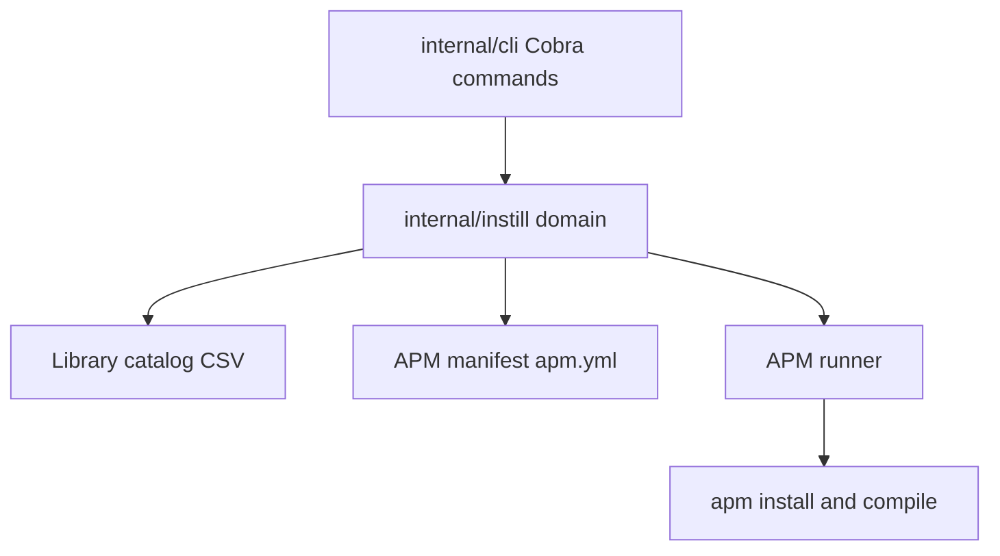

# CLAUDE.md

This file provides guidance to Claude Code (claude.ai/code) when working with code in this repository.

## What This Is

`instill` is a Go CLI for curating a **Library catalog** of AI agent capabilities and syncing selected project entries through APM. instill owns catalog UX and project selection. APM owns dependency resolution, lockfile management, install, compile, security scanning, and rendered agent artifacts.

The module is `github.com/AvogadroSG1/instill`. The CLI uses **Cobra** for command wiring and **Bubbletea** for interactive selection.

<!-- BEGIN BEADS INTEGRATION v:1 profile:minimal hash:ca08a54f -->
## Beads Issue Tracker

This project uses **bd (beads)** for issue tracking. Run `bd prime` to see full workflow context and commands.

### Quick Reference

```bash
bd ready              # Find available work
bd show <id>          # View issue details
bd update <id> --claim  # Claim work
bd close <id>         # Complete work
```

### Rules

- Use `bd` for ALL task tracking — do NOT use TodoWrite, TaskCreate, or markdown TODO lists
- Run `bd prime` for detailed command reference and session close protocol
- Use `bd remember` for persistent knowledge — do NOT use MEMORY.md files

## Session Completion

**When ending a work session**, you MUST complete ALL steps below. Work is NOT complete until `git push` succeeds.

**MANDATORY WORKFLOW:**

1. **File issues for remaining work** - Create issues for anything that needs follow-up
2. **Run quality gates** (if code changed) - Tests, linters, builds
3. **Update issue status** - Close finished work, update in-progress items
4. **PUSH TO REMOTE** - This is MANDATORY:
   ```bash
   git pull --rebase
   bd dolt push
   git push
   git status  # MUST show "up to date with origin"
   ```
5. **Clean up** - Clear stashes, prune remote branches
6. **Verify** - All changes committed AND pushed
7. **Hand off** - Provide context for next session

**CRITICAL RULES:**
- Work is NOT complete until `git push` succeeds
- NEVER stop before pushing - that leaves work stranded locally
- NEVER say "ready to push when you are" - YOU must push
- If push fails, resolve and retry until it succeeds
<!-- END BEADS INTEGRATION -->

## Build And Test

```bash
make build           # build binary to ./instill
make unit-test       # go test ./...
make bats-test       # integration tests via bats
make test            # unit + bats
make lint            # golangci-lint
make vet             # go vet ./...
make install         # install to ~/.local/bin/instill
```

Focused commands:

```bash
go test ./internal/instill ./internal/cli -run 'TestCheckSkills|TestReconcile|TestSettingsLocal|TestLegacy' -v
bats test/instill.bats
```

## Ubiquitous Language

| Term | Meaning |
|------|---------|
| Library catalog | Typed CSV catalog under the configured library root |
| Typed library entry | One catalog row for a skill, MCP server, instruction, or prompt |
| APM manifest | Project-local `apm.yml` committed to the repo |
| Sync | `instill sync`, which runs `apm install` and `apm compile` |
| Project content | Copied `.apm/instructions/*.instructions.md` and `.apm/prompts/*.prompt.md` files |

Legacy terms such as skill manifest, symlink reconciliation, and `settings.local.json` permission ownership SHOULD only appear in import or migration code.

## Architecture



- `internal/cli/` MUST only wire commands, parse flags, and pass injected `commandConfig` dependencies.
- `internal/instill/` MUST hold domain behavior with explicit paths, writers, and command runners.
- Domain code MUST use `ExitError` for CLI-facing errors and MUST NOT call `os.Exit`.
- Writes MUST go through atomic helpers when persisting project or library files.

## Commands

| Command | Domain entry | Purpose |
|---------|--------------|---------|
| `instill init` | `InitProject` | Create the APM manifest and optionally seed skill dependencies |
| `instill targets` | `SetProjectTargets` | View or configure project target agents |
| `instill pick` | `Pick` / `RunPickTUI` | Add or remove typed library entries |
| `instill sync` | `SyncProject` | Run `apm install`, `apm compile`, then report counts |
| `instill status` | `ProjectStatus` | Compare project APM state with the Library catalog |
| `instill library scan` | `ScanLibrary` | Rebuild typed catalog CSV files |
| `instill library add` | `AddCatalogEntry` | Add one typed catalog row |
| `instill library show` | `ShowCatalog` | Display typed catalog rows |
| `instill import` | import functions | Migrate old instill, graft, Claude config, or generic content |
| `instill bootstrap` | `EnsureAPM` | Ensure the external APM CLI is available |
| `instill add-hooks` | `AddHooks` | Register `instill sync` as the Claude Code `SessionStart` hook |

`instill check-skills` is a hidden legacy command. It MUST exit 1 with migration guidance and MUST NOT mutate project state.

## Layout On Disk

```text
~/.config/instill/config.json

Library root from INSTILL_LIBRARY_PATH/
  skills/catalog.csv
  skills/<name>/SKILL.md
  mcp/catalog.csv
  mcp/<name>/config.json
  instructions/catalog.csv
  instructions/<name>/INSTRUCTION.md
  prompts/catalog.csv
  prompts/<name>/PROMPT.md

project/
  apm.yml
  apm.lock.yaml
  .apm/
    instructions/<name>.instructions.md
    prompts/<name>.prompt.md
  .claude/settings.json
```

## Configuration

`ResolveLibraryPath` MUST resolve the Library catalog path in this order:

1. `INSTILL_LIBRARY_PATH`
2. `SKILL_LIBRARY_PATH` migration fallback
3. `~/.config/instill/config.json`
4. Interactive prompt when stdin is a TTY

APM-facing commands MUST call `EnsureAPM` before mutating project APM state. Library-only commands MUST NOT bootstrap or invoke APM.

## Legacy Boundaries

- Legacy `skill-manifest.json`, `.claude/skills` symlinks, `.agents/skills` symlinks, and `settings.local.json` permission reconciliation are migration concerns.
- Supported commands MUST NOT depend on symlink reconciliation.
- Import code MAY retain small helpers to read or remove legacy artifacts.
- Hidden legacy command names MUST give migration guidance instead of mutating state.

## Conventions

- Use RFC 2119 terms for requirements.
- Use `t.TempDir()` and injected runners/writers in tests.
- Use `INSTILL_LIBRARY_PATH` in new tests and docs; use `SKILL_LIBRARY_PATH` only for fallback coverage.
- Keep PRs small and keep command behavior covered by Go tests plus `test/instill.bats`.
- Commit messages MUST include both required co-author trailers from the repository instructions.

## Related Docs

- `README.md` - user-facing install and workflow
- `docs/adr/0002-apm-backed-library-catalog.md` - APM-backed Library catalog decision
- `docs/adr/0001-manifest-as-permission-ownership-boundary.md` - legacy permission ownership context
- `CONTRIBUTING.md` - contribution workflow
