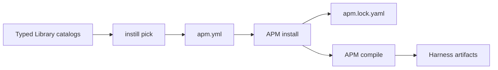

# instill

Instill is a CLI that curates typed Library entries for AI coding projects and delegates package installation and harness rendering to APM.

## Language

**Library**:
A developer-local collection of typed catalog entries. Its path is configured by `INSTILL_LIBRARY_PATH`, the legacy `SKILL_LIBRARY_PATH`, or `~/.config/instill/config.json`.

**Library entry**:
A named catalog record of type Skill, Plugin, MCP Server, Instruction, or Prompt. Entries can reference local Library content; Skills and Plugins can also reference immutable Git sources.

**Skill**:
A package containing agent instructions rooted at `SKILL.md` that Instill supplies to APM. Skills are one Library entry type and MUST NOT be used as the generic term for Plugins or other entry types.

**Plugin**:
A harness plugin artifact containing extension metadata, commands, Skills, hooks, or related content that APM normalizes and installs as a package. A repository-backed Plugin is discovered through publisher-owned Claude marketplace metadata and pinned by repository, package path, and commit SHA.

**Project**:
A directory containing the committed APM manifest `apm.yml`. Instill discovers a Project by walking up from the current directory.

**APM manifest**:
The committed `apm.yml` file declaring selected APM packages, MCP Servers, and harness targets. It is the project selection contract written by Instill and consumed by APM.

**Source pin**:
The full immutable Git commit SHA recorded in a Skill or Plugin catalog entry and copied into `apm.yml` by an explicit `pick`. `sync` MUST NOT advance source pins.

**APM lockfile**:
The `apm.lock.yaml` installation state owned by APM. It MUST NOT be treated as the Library catalog or the project selection contract.

**Sync**:
The operation that runs APM install and compile for the existing manifest selection. Sync installs selected pins and renders configured targets; it MUST NOT discover newer Git revisions.

## Relationships

- Instill MUST own Library discovery, catalog curation, project selection, and copied Instruction or Prompt content.
- APM MUST own package retrieval, lock state, security scanning, and harness-specific rendering.
- Local and Git-backed Skills and Plugins share `dependencies.apm`; typed catalog membership is the Instill ownership boundary.
- Git package replacement and removal use stable identity (`repository + package path`), while exact installation changes include the immutable ref.
- Entries in `dependencies.apm` not owned by the selected typed catalog MUST remain unchanged when Instill applies a Skill or Plugin selection.

## Example Dialogue

> **Developer:** "Does `instill sync` update Impeccable to the latest commit?"
>
> **Domain expert:** "No. Run `library update` to refresh the Library source pin, review it, then run `pick` to update the Project manifest. `sync` installs that selected pin."

> **Developer:** "Can one repository publish several Plugins?"
>
> **Domain expert:** "Yes. Register the repository with `--name` so Instill selects one plugin declared in its root Claude marketplace."

*Authored By Peter O'Connor with Assistance from OpenCode (openai/gpt-5.6-sol) · 2026-08-22 · Instill ubiquitous language and architecture context*
