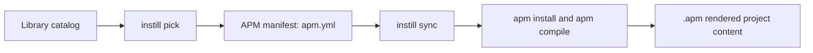

# instill

[](https://go.dev/)
[](./LICENSE)
[![Build Status][build-badge]][build-url]

`instill` curates a typed Library catalog for project-specific AI agent capabilities and delegates dependency resolution, lockfiles, install, and compile work to APM.

## Model

instill is the curated library UX. APM is the sync engine.



- The **Library catalog** lives under `INSTILL_LIBRARY_PATH` and uses typed CSV files for skills, MCP servers, instructions, and prompts.
- The **APM manifest** is the project-local `apm.yml` file committed with the project.
- **Sync** means `instill sync` runs `apm install`, then `apm compile`, then reports installed counts.
- **Typed library entries** let one library manage skills, MCP servers, instructions, and prompts without overloading a skill-only manifest.

## Install

```bash
go install github.com/AvogadroSg1/instill@latest

# Or build locally
make install
```

APM MUST be available for commands that touch project APM state. If `apm` is missing, instill will try to install the configured APM formula with Homebrew.

## Configure The Library

```bash
export INSTILL_LIBRARY_PATH=~/path/to/agent-library
```

`INSTILL_LIBRARY_PATH` has highest precedence. `~/.config/instill/config.json` is used when the environment variable is absent. `SKILL_LIBRARY_PATH` remains a migration fallback only.

Expected library shape:

```text
~/path/to/agent-library/
  skills/catalog.csv
  skills/golang-testing/SKILL.md
  mcp/catalog.csv
  mcp/local-db/config.json
  instructions/catalog.csv
  instructions/python-rules/INSTRUCTION.md
  prompts/catalog.csv
  prompts/debug/PROMPT.md
```

Run `instill library scan` to create or refresh catalog CSV files from library content.

### Remote Skills

Register a GitHub skill with its repository alone:

```bash
instill library add --type skill --repository owner/repo
```

Instill derives the skill name from `repo`, verifies `skills/{repo}/SKILL.md`, and records the canonical clone URL (`https://github.com/owner/repo.git`), virtual package path (`skills/{repo}`), and the default branch's full immutable commit SHA in `skills/catalog.csv`. The expanded skill catalog schema is `name,category,path,source,repository,ref,description`; existing four-column local catalogs remain readable and are migrated on write.

Public repositories require no special setup. Private repositories use the user's normal Git credential helpers and SSH/HTTPS configuration when Git accesses GitHub. Instill never accepts, writes, or stores credentials.

The catalog SHA is the source pin. When APM installs it, its lockfile records the resolved package as a second pin. Instill MUST NOT update either pin automatically. To intentionally refresh a remote skill to its current default-branch commit, run:

```bash
instill library update --type skill --name repo
instill pick --type skill repo
instill sync
```

The explicit `pick` updates this project's manifest to the catalog SHA. `sync` alone MUST NOT change project dependency refs. Review and commit the catalog, manifest, and APM lockfile changes after an explicit upgrade.

## Project Workflow

```bash
cd your-project
instill init --skills golang-testing
instill pick --type instruction python-rules
instill pick --type prompt debug
instill sync
instill add-hooks
```

Project artifacts:

```text
your-project/
  apm.yml                  # committed APM manifest
  apm.lock.yaml            # APM lockfile when produced by APM
  .apm/
    instructions/*.instructions.md
    prompts/*.prompt.md
  .claude/settings.json    # SessionStart hook from instill add-hooks
```

`instill add-hooks` registers `instill sync` as the Claude Code `SessionStart` hook so each new session refreshes APM-managed project content.

## Commands

| Command | Description |
|---------|-------------|
| `instill init` | Create `apm.yml` for the current project and optionally seed skills |
| `instill targets` | View or configure target agents for compilation |
| `instill pick [name...]` | Add or remove typed library entries from `apm.yml` or copied `.apm/` content |
| `instill sync` | Run `apm install`, then `apm compile`, and report synced counts |
| `instill status` | Compare project APM state with the Library catalog |
| `instill library scan` | Rebuild typed catalog CSV files from library content |
| `instill library add` | Add one typed catalog entry |
| `instill library update --type skill --name NAME` | Refresh an explicitly selected remote skill's immutable SHA pin |
| `instill library show` | List typed catalog entries |
| `instill import` | Import legacy instill, graft, Claude config, or generic directories |
| `instill bootstrap` | Ensure APM is installed and meets the minimum version |
| `instill add-hooks` | Register the `instill sync` SessionStart hook |

Legacy commands such as `instill check-skills` MUST NOT mutate project state. `check-skills` exits with migration guidance naming `instill sync`.

## Configuration

| Source | Precedence |
|--------|------------|
| `INSTILL_LIBRARY_PATH` environment variable | Highest |
| `SKILL_LIBRARY_PATH` environment variable | Migration fallback |
| `~/.config/instill/config.json` | Stored default |
| Interactive TTY prompt | Lowest |

`~/.config/instill/config.json` format:

```json
{
  "library_path": "~/ObsidianNotes/agent_config/skills"
}
```

## Exit Codes

| Code | Meaning |
|------|---------|
| `0` | Success |
| `1` | General error |
| `2` | Environment error |
| `3` | Filesystem error |

## Contributing

See [CONTRIBUTING.md](./CONTRIBUTING.md).

## License

MIT — see [LICENSE](./LICENSE).

[build-badge]: https://img.shields.io/github/actions/workflow/status/AvogadroSg1/instill/test.yml?branch=main
[build-url]: https://github.com/AvogadroSg1/instill/actions
