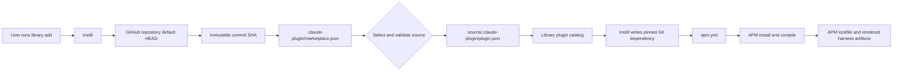

# Repository-backed Library plugins from Claude marketplace metadata

## Metadata

| Field | Value |
|-------|-------|
| Date | 2026-08-22 |
| Status | Accepted |
| Scope | Team |
| Authors | Peter O'Connor |
| Type | Decision |

## Problem Statement

The Library can catalog local plugins, but it cannot register a plugin published in a remote repository without the user first reproducing repository layout details as local catalog metadata. Repositories can contain one or more plugins at different paths, so a remote repository name alone does not provide an unambiguous package name, package root, or immutable version.

The registration flow needs a deterministic way to discover those values, reject unsafe or malformed content before changing the catalog, and preserve the ownership boundary established in [ADR 0002](0002-apm-backed-library-catalog.md).

## Decision Drivers

- A user MUST be able to register a repository-backed plugin without cloning it into the Library.
- Plugin discovery MUST use publisher-owned metadata rather than an Instill-specific repository layout.
- Every cataloged remote plugin MUST be pinned to a full immutable Git commit SHA.
- Selection MUST be unambiguous for both single-plugin and multi-plugin repositories.
- A repository-provided path MUST NOT escape or redirect outside that repository.
- Failed discovery or validation MUST NOT mutate the Library catalog.
- Instill MUST preserve APM ownership of dependency installation, lock state, security scanning, and harness rendering.
- The first implementation SHOULD reuse the existing GitHub repository and credential behavior used by remote skills.

## Considered Options

### Option 1: Status quo (keep repository-backed plugins unsupported)

Users would continue to clone plugin repositories themselves and add local plugin paths to the Library.

- Rejected because it duplicates repository setup on every machine and leaves provenance and revision pinning outside the catalog.
- Rejected because it does not provide a portable repository-backed package for APM.
- Rejected despite preserving the current implementation without a remote metadata dependency.
- Rejected despite supporting arbitrary repository layouts through manual configuration.

### Option 2: Use a fixed repository layout

Instill would assume a conventional plugin root, such as the repository root or `plugins/{repo}`.

- Rejected because it excludes valid repositories with other layouts and cannot select among multiple plugins.
- Rejected because the convention would be specific to Instill rather than declared by plugin publishers.
- Rejected despite being simple to explain without requiring marketplace metadata.
- Rejected despite matching the fixed-layout convention already used by remote skills.

### Option 3: Require an explicit package path

Instill would require the user to provide the package root together with the repository and plugin name.

- Rejected because it makes users inspect and transcribe publisher internals that can change independently.
- Rejected because user-supplied names and paths can drift from plugin metadata, weakening deterministic discovery.
- Rejected despite supporting arbitrary layouts and multi-plugin repositories without parsing marketplace metadata.
- Rejected despite keeping implementation complexity low while preserving immutable repository pins.

### Option 4 (Selected): Discover plugins from Claude marketplace metadata

Instill would read the repository's root `.claude-plugin/marketplace.json`, select an entry from its `plugins` array, validate its repository-local `source`, and verify the selected plugin manifest.

- Adopted because publisher-maintained metadata supports both singleton and multi-plugin repositories.
- Adopted because it gives Instill a deterministic name-to-package mapping without an Instill-specific remote manifest.
- Adopted despite requiring valid Claude marketplace metadata even when the plugin is otherwise usable.
- Adopted despite requiring Instill to maintain a security boundary around untrusted marketplace paths and JSON.

## Decision Outcome

Chosen option: **Option D: discover plugins from Claude marketplace metadata**.

Despite the additional metadata validation, this option provides publisher-owned discovery and deterministic multi-plugin selection while keeping package installation with APM.

## Advice

- Instill MUST discover repository-backed plugins from root Claude marketplace metadata at an immutable commit.
- Instill MUST validate all remote metadata and repository paths before mutating a catalog.
- Typed Library catalogs MUST remain the ownership boundary for dependencies sharing `dependencies.apm`.
- A stable Git package identity MUST exclude the revision; an exact identity MUST include it.
- Repository and package resolution SHOULD reuse one Git snapshot abstraction across skills and plugins.
- Repository fetches SHOULD retrieve only the resolved commit rather than full history.
- Singleton marketplaces MAY omit `--name`; multi-plugin marketplaces MUST require it.

### Command Semantics

The supported command is:

```bash
instill library add --type plugin --repository owner/repo [--name plugin]
```

- `--repository` MUST accept only a GitHub `owner/repo` identifier with an optional trailing `.git` suffix in this phase. Instill MUST normalize the suffix and lowercase the owner and repository components before constructing the canonical clone URL or stable identity. Other Git hosts, arbitrary URLs, and local Git repositories MUST be rejected.
- Instill MUST resolve the repository's default branch to a full 40-character commit SHA before reading metadata.
- Instill MUST read `.claude-plugin/marketplace.json` from that exact commit, not from a mutable branch after resolution.
- If the marketplace declares exactly one plugin and `--name` is omitted, Instill MUST select that singleton.
- Marketplace plugin names MUST be unique. Duplicate names MUST be rejected as ambiguous before catalog mutation.
- If the marketplace declares more than one plugin, `--name` MUST be provided and MUST exactly match one declared plugin name. An omitted or unknown name MUST report the sorted available names without changing the catalog.
- If `--name` is supplied for a singleton marketplace, it MUST match that plugin.
- An empty marketplace MUST be rejected without changing the catalog.
- `pbakaus/impeccable` MUST pass as an acceptance example through these general rules; it MUST NOT receive repository-specific behavior.

### Marketplace And Path Validation

The selected marketplace entry's `source` MUST be a string identifying a repository-local directory. Instill MUST normalize it using slash-separated repository paths and MUST reject an empty path, an absolute path, a URL, a backslash-separated path, a NUL byte, or any path containing a `..` segment. After normalization, the path MUST remain within the repository tree at the resolved SHA.

Instill MUST read marketplace and plugin metadata directly from Git objects at the resolved SHA without checking files out or dereferencing repository symlinks. A selected source or marker reached through a Git symlink MUST be rejected. Instill MUST verify `<source>/.claude-plugin/plugin.json` at the same SHA. The file MUST exist, MUST be a regular blob, MUST parse as JSON, and its plugin name MUST match the selected marketplace entry. Marketplace parsing, source validation, and plugin-manifest verification MUST all complete before the catalog is written.

### Pinning And Identity

The catalog entry MUST record the canonical GitHub clone URL, normalized plugin source path, and resolved full commit SHA. The SHA is the catalog's immutable source pin and MUST NOT be replaced by a branch, tag, abbreviated SHA, or other mutable reference.

The stable identity of a repository-backed plugin is `repository + path`. Instill MUST use that identity to recognize the same package across an intentional pin refresh. The exact resolved dependency identity is `repository + path + ref`; APM and its lockfile MAY use that exact identity to distinguish revisions. A changed `ref` alone MUST be treated as an upgrade of the stable package, while a changed repository or path MUST be treated as a different package.

`instill library update --type plugin --name plugin` MUST explicitly refresh the catalog entry from the repository's current default branch while preserving user-curated category and description. If current marketplace metadata resolves the plugin name to a different package path, update MUST reject the identity-changing move without catalog mutation; package moves require a separately designed migration workflow. A subsequent `instill pick --type plugin plugin` MUST replace any project dependency with the same stable identity, leaving exactly one dependency at the catalog SHA. `instill sync` MUST NOT refresh either pin by itself.

### Ownership Boundary

Instill owns marketplace discovery, selection, validation, catalog curation, and writing the pinned Git dependency into `apm.yml`. APM owns dependency retrieval for project installation, lockfile state, security scanning, compilation, and harness-specific rendering. `library add` MUST remain a Library-only command and MUST NOT bootstrap or invoke APM.

Skills and plugins share `dependencies.apm`, so typed catalog membership MUST determine ownership. Skill operations MUST match only stable identities present in the skill catalog, plugin operations MUST match only stable identities present in the plugin catalog, and unmatched Git dependencies MUST remain unchanged. Exact identity MUST determine whether the selected project revision equals the catalog pin, while stable identity MUST drive replacement and removal.

A stable Git identity MUST NOT appear in both the skill and plugin catalogs. Remote registration MUST reject a cross-catalog collision without mutation. If manually edited catalogs contain a collision, pick, picker, and status operations MUST fail with an ambiguity error before changing project state rather than assigning the dependency to either type.



## Consequences

### Positive

- Repository-backed plugins become portable catalog entries with immutable provenance.
- Singleton repositories have a minimal command, while multi-plugin repositories remain explicit and deterministic.
- Publisher metadata, rather than an Instill-specific convention, defines plugin package roots.
- Existing APM ownership boundaries remain intact.

### Negative

- Repositories without valid root Claude marketplace metadata cannot use this registration path.
- Marketplace and plugin manifests are untrusted remote input and add parsing and path-validation complexity.
- GitHub is the only supported host in this phase.
- Moving a plugin within a repository changes its stable identity even if its marketplace name is unchanged.

### Neutral

- Existing local plugin entries remain valid and require no migration.
- Existing remote skill behavior remains unchanged.
- Refreshing a pin remains an explicit operation; normal sync MUST NOT silently move a repository-backed plugin to a newer commit.

## Impact

**Instill Maintainers** MUST implement and review the resolver, catalog migration, picker behavior, and documentation in this feature. Existing Instill users require no immediate action because local plugin rows remain readable and project pins move only through explicit commands.

Implementation is expected to complete during the current feature branch before merge. The migration is lazy: existing four-column plugin catalogs remain readable and are rewritten to seven columns on the next catalog write.

## Rollout

1. Extend the plugin catalog schema and validation to support `source: git`, canonical repository URLs, normalized package paths, and full commit SHAs while retaining existing local rows.
2. Add marketplace discovery and plugin-manifest verification behind `library add --type plugin --repository`.
3. Add `library update --type plugin --name` with immutable re-resolution, metadata preservation, failure atomicity, and package-path stability checks.
4. Add pinned plugin Git dependencies to the existing pick and manifest flow without changing local plugin behavior.
5. Document explicit plugin pin refresh only after add, update, pick, sync, and compatibility tests pass. No existing catalog entry MUST be rewritten merely by upgrading Instill.

The rollout MAY be reverted by disabling the repository-backed plugin command path; local plugin catalogs and previously generated pinned APM dependencies remain readable.

## Confirmation

The implementation MUST add the following BDD tests with these exact names:

- `TestAddRemotePluginInfersSingletonFromMarketplace` confirms `owner/repo` resolution, exact-SHA metadata reads, manifest verification, canonical catalog fields, and no APM invocation.
- `TestAddRemotePluginNormalizesOptionalGitSuffix` confirms `owner/repo` and `owner/repo.git` produce the same canonical repository without a doubled suffix.
- `TestAddRemotePluginCanonicalizesGitHubRepositoryCase` confirms casing variants produce one lowercase canonical repository and stable identity.
- `TestAddRemotePluginSelectsNamedPluginFromMultiPluginMarketplace` confirms explicit selection from multiple entries.
- `TestAddRemotePluginRequiresNameForMultiPluginMarketplace` confirms an ambiguity error listing sorted available names and an unchanged catalog.
- `TestAddRemotePluginRejectsUnknownMarketplaceNameWithoutMutation` confirms singleton and multi-plugin name mismatches report sorted available names and preserve the catalog byte for byte.
- `TestAddRemotePluginRejectsDuplicateMarketplaceNamesWithoutMutation` confirms selection must resolve to exactly one declaration.
- `TestAddRemotePluginRejectsMalformedOrEmptyMarketplaceWithoutMutation` confirms malformed JSON and empty plugin lists preserve the catalog byte for byte.
- `TestAddRemotePluginRejectsUnsafeSourcePathsWithoutMutation` covers empty and absolute paths, URLs, backslashes, NUL bytes, and `..` traversal while preserving the catalog byte for byte.
- `TestAddRemotePluginRejectsSymlinkedSourceWithoutMutation` confirms Git-object reads cannot escape or traverse a repository symlink.
- `TestAddRemotePluginRejectsMissingOrInvalidPluginManifestWithoutMutation` confirms `.claude-plugin/plugin.json` existence, JSON parsing, name matching, and byte-for-byte catalog preservation.
- `TestRemotePluginCatalogRejectsNonImmutableRef` confirms that only full commit SHAs are accepted.
- `TestUpdateRemotePluginRefreshesSHAAndPreservesCuratedMetadata` confirms immutable re-resolution and metadata preservation.
- `TestUpdateRemotePluginRejectsPackagePathChangeWithoutMutation` confirms identity-changing marketplace moves do not rewrite the catalog.
- `TestUpdateRemotePluginFailurePreservesCatalogByteForByte` confirms malformed metadata, inaccessible repositories, and invalid manifests are atomic.
- `TestRemotePluginIdentityIgnoresRefButExactIdentityIncludesRef` confirms stable `repository + path` identity and exact `repository + path + ref` identity.
- `TestPickAddsPinnedRemotePluginDependency` confirms that `apm.yml` receives the canonical repository, normalized package path, and exact SHA.
- `TestPickRefreshesRemotePackageWithoutDuplicateDependency` begins with an old ref and confirms an explicit pick leaves exactly one dependency at the new ref for both skills and plugins.
- `TestTypedGitDependencyOwnershipIsPreserved` confirms skill operations preserve plugin Git dependencies, plugin operations preserve skill Git dependencies, and both preserve unmatched Git dependencies.
- `TestRemoteRegistrationRejectsCrossCatalogIdentityCollisionWithoutMutation` confirms a stable identity cannot be owned by both typed catalogs.
- `TestAmbiguousTypedGitIdentityFailsBeforeProjectMutation` confirms manually introduced cross-catalog collisions stop pick, picker, and status behavior without changing project state.
- `TestRemotePluginPickerAndStatusUseStableIdentity` confirms a selected old ref remains owned by the plugin catalog and is reported as needing explicit refresh rather than as an unrelated dependency.
- `TestSyncDoesNotRefreshRemotePluginManifestPin` confirms normal sync preserves the project's existing immutable plugin ref.
- `TestPluginCatalogReadsLegacyFourColumnRows` confirms existing local plugin catalogs remain compatible.
- `TestPluginCatalogMigratesLegacyRowsOnlyOnWrite` confirms a catalog write expands rows to seven columns while an Instill upgrade alone leaves files untouched.
- `TestLibraryAddRemotePlugin` confirms CLI singleton inference and multi-plugin `--name` behavior.
- `TestLibraryUpdateRemotePlugin` confirms CLI dispatch, success, unsupported-type errors, and actionable failures.
- The BATS case `library add registers a repository-backed plugin from marketplace metadata` confirms the public command using `pbakaus/impeccable` only as a normal acceptance example.

Before merge, the focused tests MUST pass with:

```bash
go test ./internal/instill ./internal/cli -run 'Test(AddRemotePlugin|UpdateRemotePlugin|RemotePlugin|Pick.*Remote|TypedGit|RemoteRegistration|AmbiguousTyped|SyncDoesNotRefreshRemotePlugin|PluginCatalog|Library(Add|Update)RemotePlugin)' -count=1
bats test/instill.bats
```

Automated CI/CD enforcement is provided by the GitHub Actions `Quality Gates` job, which MUST pass its exact gates: `go test ./...`, `go test -race ./...`, `go vet ./...`, `make lint`, `bats test`, and the GoReleaser configuration check. The `Build darwin/amd64`, `Build darwin/arm64`, `Build linux/amd64`, and `Build linux/arm64` matrix jobs MUST also pass their target `go vet ./...` and `go build` gates. A pull request MUST NOT merge if any test or CI gate fails.

*Authored By Peter O'Connor with Assistance from OpenCode (openai/gpt-5.6-sol) · 2026-08-22 · Architecture decision for repository-backed Library plugins*
