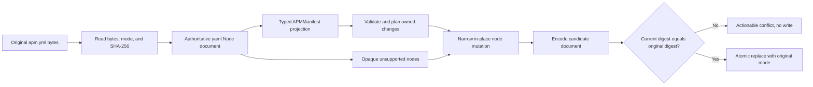

# Node-semantic APM manifest updates

## Metadata

| Field | Value |
|-------|-------|
| Date | 2026-08-22 |
| Status | Accepted |
| Scope | Team |
| Authors | Peter O'Connor |
| Type | Decision |

## Problem Statement

Instill reads `apm.yml` into typed Go values and some write paths marshal those values as a new document. That process can discard fields Instill does not understand, comments, scalar styles, anchors, aliases, ordering, and other user-authored YAML semantics even when an operation intends to change only one dependency.

Manifest updates need one preservation contract that lets Instill repair and reconcile the fields it owns without claiming the rest of the APM document or causing nominally read-only commands to rewrite it. Cross-process serialization is decided separately by ADR 0006.

## Decision Drivers

- Instill MUST preserve every manifest node outside the exact fields owned by the requested operation.
- Instill MUST preserve comments, scalar and collection styles, anchors, aliases, mapping order, sequence order, tags, and unknown fields when they are representable by `gopkg.in/yaml.v3` nodes.
- Instill MUST retain unsupported dependency entries as opaque nodes rather than rejecting, normalizing, or deleting them.
- Instill MUST use typed values for validation and business rules without making typed marshaling authoritative for output.
- Instill MUST reuse existing Git and MCP dependency nodes when their identities match.
- Instill MUST perform a best-effort pre-replacement check for an external manifest edit and MUST preserve the original file mode.
- Mutating commands MUST fail before writing when the requested narrow mutation cannot preserve node semantics safely.
- Read-only operations and instruction- or prompt-only operations MUST NOT rewrite `apm.yml`.
- The migration SHOULD consolidate the existing document helpers rather than create a second mutation system.

## Considered Options

### Option 1: Status quo, marshal the typed manifest

Continue decoding `apm.yml` into `APMManifest`, changing typed fields, and serializing the complete struct.

- Rejected because unknown top-level and dependency fields can be lost.
- Rejected because comments, styles, anchors, aliases, and user ordering are not part of the typed model.
- Rejected despite having the smallest immediate implementation cost.
- Rejected despite making normalization and typed validation straightforward.

### Option 2: Add inline `Extra` maps to every typed structure

Extend top-level, dependency, Git, and MCP structs with `yaml:",inline"` maps and continue marshaling typed values.

- Rejected because `map[string]any` preserves more values but not node identity, comments, aliases, styles, or reliable key order.
- Rejected because every newly discovered extension point would require another typed escape hatch and collision policy.
- Rejected despite fitting the current typed APIs and already helping preserve unknown Git and MCP mapping values.
- Rejected despite providing convenient typed access to unsupported scalar data.

### Option 3 (Selected): Authoritative `yaml.Node` document with a typed projection

Parse the source once into an authoritative `yaml.Node` document, derive an `APMManifest` projection for validation and planning, and apply approved changes directly to narrowly selected nodes in the authoritative tree.

- Adopted because node-level edits preserve user-owned structure and presentation while retaining typed business logic.
- Adopted because identity-aware matching can update an existing dependency without replacing its mapping, position, or unknown children.
- Adopted despite requiring explicit traversal, mutation, alias-safety checks, and more focused tests.
- Adopted despite `yaml.Node` not preserving every byte-level concrete-syntax detail.

### Option 4: Preserve a literal concrete syntax tree (CST)

Use or build a parser and editor that retains every token, whitespace choice, directive, and byte range, then patch source spans.

- Rejected because byte-perfect editing adds a parser dependency or substantial custom machinery beyond the required preservation contract.
- Rejected because source-span edits around anchors, aliases, flow collections, and duplicate keys still require semantic validation.
- Rejected despite offering the strongest possible formatting preservation.
- Rejected despite enabling byte-for-byte assertions outside changed token ranges.

## Decision Outcome

Chosen option: **Option 3: authoritative `yaml.Node` document with a typed projection**.

The approved meaning of **node-semantic preservation** is that an Instill write MUST retain the kind, tag, value, mapping and sequence order, style, anchor name, alias relationship, and head, line, and foot comments of every node it does not own. For an owned value that changes, Instill MUST preserve the existing key node, mapping or sequence container, comments, style where valid for the new value, anchor and alias relationship where safe, sequence position, and all unknown siblings and children.

Node-semantic preservation does not promise byte-for-byte preservation of whitespace, indentation, document separators, directive spelling, or other lexical details that `yaml.Node` does not model. A no-op path MUST perform no write and therefore remains byte-for-byte unchanged; a successful mutation MAY allow `yaml.v3` to re-render unmodeled lexical details.

## Architecture



The authoritative document MUST be the source of serialized output. The typed projection MUST be derived from that document and MUST be used only to validate supported fields, calculate ownership and identity, and plan changes. Instill MUST NOT serialize the typed projection as the complete manifest.

## Advice

### Document Contract

- A manifest document abstraction MUST retain the source path, authoritative document node, typed projection, original SHA-256 digest, original permission bits, and whether the source existed.
- A present manifest MUST contain exactly one YAML document whose root is a mapping. Unsupported root shapes MUST produce an actionable malformed-manifest error without a write.
- A new manifest MAY begin from a new document mapping and MUST use the normal default mode of `0o644` subject to the process umask.
- The projection MUST normalize values only in memory. Normalization MUST NOT itself mark the document dirty.
- Every mutating operation MUST first build and validate its complete mutation plan. It MUST then apply that plan to the authoritative tree and write at most once.
- If a plan produces no node change, Instill MUST NOT encode or write the manifest.

### Narrow In-place Mutation

- Instill MUST navigate by mapping key and dependency identity and MUST mutate only fields owned by the requested operation.
- Existing mapping key nodes and collection nodes MUST be reused. An owned scalar value SHOULD be changed on its existing node when its kind and alias relationships remain valid.
- Adding a missing field MUST append the smallest required key and value pair to its existing parent mapping. It MUST NOT rebuild that mapping.
- Removing a dependency MUST remove only the matched key-value pair or sequence item. It MUST NOT normalize adjacent entries.
- Unknown top-level keys, unknown keys below `dependencies`, and unknown keys within a supported dependency mapping MUST remain in their original order with their node metadata.

### Exact Field Ownership

- Identity repair owns only absent top-level `name` and `version`. It appends `name: <project-directory-basename>` and `version: 0.1.0`; it MUST NOT replace present values outside `init --force`.
- Skill and Plugin pick own only entries in `dependencies.apm` whose identities match the active typed catalog, requested additions, and stale local scalar paths under the corresponding Library type root. They MUST NOT mutate opaque or unmatched APM entries.
- MCP pick and sync own `name`, `transport`, `registry`, `command`, `args`, `env`, and `url` on a mapping whose non-empty scalar `name` matches the MCP catalog. Reconciliation MUST set non-empty catalog values, remove an owned key whose catalog value is absent, and preserve every other key. Because Library MCP entries are direct definitions rather than registry references, `registry` MUST always be written as explicit boolean `false`; a missing or true value on a matched entry MUST become `false`.
- `SetProjectTargets` owns only plural top-level `targets`. An explicit empty selection MUST write `targets: []`; it MUST NOT remove the key.
- Sync owns plural `targets` only when that key is absent. It MUST initialize absent `targets` from detected harnesses, MUST preserve an explicitly empty sequence, and MUST NOT interpret or mutate singular `target`.
- Singular top-level `target` is an unknown compatibility field and MUST remain untouched. If both `target` and `targets` exist, only plural `targets` participates in Instill behavior.
- Init owns `name`, `version`, plural `targets`, and supported Instill-owned entries within `dependencies.apm` and `dependencies.mcp`. On a new document it creates those managed values. Under `--force` it replaces supported managed entries while preserving every other top-level field, every unknown child of `dependencies`, and every opaque or unmatched dependency node within the managed sequences.
- Old-Instill import owns identity repair and merged `dependencies.apm`; Graft import owns identity repair and merged `dependencies.mcp`. Imports MUST preserve all other fields and nodes.

### Dependency Shape Classification And Matching

- A non-empty APM scalar is owned as a local dependency only when it equals a catalog-derived local package path or is a stale path contained under the active typed Library root. Every other scalar, including a remote shorthand, MUST remain opaque passthrough content.
- An APM mapping containing `git` is a supported Git shape when `git` and `path` are non-empty scalars and optional `ref` is absent or scalar. Its stable identity MUST be normalized `git + path`; its exact identity MUST include `ref` when present. A missing `ref` is supported and MAY be filled only when its stable identity matches a requested catalog dependency.
- An APM mapping without `git`, including marketplace and registry forms, MUST remain opaque. A mapping with `git` but missing, empty, or non-scalar `git` or `path`, or a non-scalar `ref`, is malformed supported-looking data and MUST fail a `dependencies.apm` mutation before any write.
- An MCP scalar is a valid APM shorthand but opaque to Instill and MUST remain unchanged. An MCP mapping with a non-empty scalar `name` is supported and its identity MUST be that name. A mapping with a present but empty or non-scalar `name` is malformed supported-looking data and MUST fail an MCP mutation before any write. A mapping without `name` remains opaque.
- Instill MUST match an existing Git node by stable identity and an existing MCP node by name. When matched, Instill MUST reuse the existing sequence item and mutate only owned fields, preserving its sequence position, comments, style, anchors, aliases, and unknown mapping entries.
- An exact Git identity match MUST be a no-op unless another explicitly owned Git field requires repair. A stable Git identity match with a different `ref` MUST update that existing node rather than append a duplicate.
- A matching MCP node MUST be reconciled from the authoritative catalog by updating only catalog-owned fields. Unknown MCP fields MUST remain attached to the reused node.
- A sequence entry that cannot be projected as a supported local, Git, or MCP dependency MUST remain an opaque `yaml.Node`. Instill MUST preserve it without decoding it into an `Extra` map, assigning ownership, deduplicating it, reordering it, or rejecting the whole manifest.
- An opaque node MUST NOT match a requested identity by inference. If malformed supported-looking data prevents unambiguous identity matching, Instill MUST fail with the dependency path and corrective action rather than append a possibly duplicate node.
- Duplicate supported stable Git identities or duplicate supported MCP names MUST fail before mutation because a narrow owner cannot be selected unambiguously.

### Comments, Styles, Anchors, And Aliases

- Instill MUST retain `HeadComment`, `LineComment`, `FootComment`, `Style`, `Anchor`, and `Alias` metadata on all preserved nodes.
- Instill MUST retain anchor names and alias targets; it MUST NOT silently expand aliases or convert an alias to a copied value.
- The adapter MUST index every node's parent, owning dependency subtree, anchors, and alias references before planning mutation.
- A node whose `Kind` is `AliasNode` MUST NOT be directly replaced or expanded. A requested mutation whose owned key or value is represented by an alias MUST fail.
- In-place mutation of an anchored node or any descendant MAY proceed only when every alias targeting that anchor is contained within the same owned dependency subtree. An alias outside that subtree is a cross-boundary alias and MUST cause failure because the managed change would alter user-owned semantics.
- Removing or replacing a subtree containing an anchor MUST fail when any alias targets that anchor. When no alias targets it, normal narrow removal MAY proceed.
- Untouched anchors and aliases outside the mutation subtree MUST remain unchanged without imposing a failure.
- If an anchored or aliased node cannot be changed safely, Instill MUST abort without writing and report the manifest path, YAML path, anchor name when available, requested change, and a remediation such as replacing the alias with an explicit value or removing the anchor.
- Instill MUST NOT fall back to replacing an anchored collection merely because direct mutation is inconvenient.

### Identity Repair And Command Behavior

- A manifest-mutating command MUST repair an absent top-level `name` with the project directory basename and an absent top-level `version` with `0.1.0` in the same planned write.
- Identity repair MUST apply only when the key is absent. Blank, null, non-scalar, or otherwise invalid existing identity values MUST produce validation errors and MUST NOT be silently replaced.
- `instill init --force` MUST use the same node-semantic update path for an existing manifest. It MAY replace fields that `init --force` explicitly owns, but it MUST preserve unknown top-level fields, unknown dependency fields, opaque dependency nodes, comments, styles, anchors, and aliases.
- Status, inspection, dry-run, help, and other read-only operations MUST NOT repair identity or write the manifest.
- Selecting, installing, removing, or reporting an instruction or prompt without another manifest-owned change MUST NOT write `apm.yml`, including for missing identity, target normalization, or formatting normalization.

The dirty/no-write contract is:

| Operation | Requested managed change | Identity missing | Result |
|---|---|---|---|
| Skill, Plugin, or MCP pick/remove | Yes | Either | Apply requested change, repair absent identity, one write |
| Skill, Plugin, or MCP repeated add/remove no-op | No | No | No write |
| Skill, Plugin, or MCP repeated add/remove no-op | No | Yes | Repair identity, one write |
| Set targets to a different value, including explicit empty | Yes | Either | Set plural `targets`, repair identity, one write |
| Set targets to the same value | No | No | No write |
| Set targets to the same value | No | Yes | Repair identity, one write |
| Sync already reconciled | No | No | No write, then APM operations |
| Sync already reconciled | No | Yes | Repair identity, one write, then APM operations |
| Import adds no dependency | No | No | No write |
| Import adds no dependency | No | Yes | Repair identity, one write |
| Instruction or Prompt operation | Not manifest-owned | Either | No manifest write or identity repair |
| Read-only operation | Not manifest-owned | Either | No manifest write or identity repair |

### Sync Transaction

- `instill sync` MUST load and parse one authoritative manifest document and compute missing identity repair, target initialization, Git ownership decisions, and MCP reconciliation against that document and one typed projection. The required pre-replacement digest reread is a raw byte precondition check, not a second authoritative parse.
- `instill sync` MUST validate all planned manifest changes before mutation and MUST commit them through one manifest write transaction. It MUST NOT write once for targets and again for dependencies.
- The manifest transaction means one digest-checked atomic replacement of `apm.yml`; it does not include APM-owned lockfiles or rendered artifacts.
- If reconciliation makes no manifest change, `instill sync` MUST NOT write `apm.yml` before invoking APM.
- A manifest validation, anchor-safety, identity ambiguity, encoding, digest-conflict, or filesystem failure MUST prevent APM install and compile from running.

### Init And Force Transaction

- Init MUST gather target and Skill selections before opening its manifest transaction. Interactive cancellation or selection failure MUST leave an existing or absent manifest unchanged.
- The interactive Skill callback MUST return a selection plan rather than mutate the Project through a nested Pick operation.
- Init MUST write at most once. It MUST NOT write an empty intermediate manifest before invoking a picker.
- New init MUST create identity, plural targets, selected `dependencies.apm`, and an empty managed `dependencies.mcp` sequence.
- `init --force` MUST replace `name` with the project basename, `version` with `0.1.0`, plural `targets` with the selected or detected targets, and supported Instill-owned APM/MCP entries with the completed initialization plan. It MUST preserve unknown top-level fields, singular `target`, unknown dependency sections, and opaque or unmatched nodes within `dependencies.apm` and `dependencies.mcp`.
- If force selection is cancelled, validation fails, or APM environment preparation fails before commit, the original manifest MUST remain unchanged.

### Atomicity, Mode, And Best-effort Conflict Detection

- Before encoding, Instill MUST retain the SHA-256 digest of the exact bytes originally read and the original file permission bits.
- Immediately before replacement, Instill MUST re-read the current destination bytes without reparsing them and compare their SHA-256 digest with the original digest. A mismatch, disappearance, or unexpected creation MUST fail as an external-edit conflict without replacing either version.
- The conflict error MUST name `apm.yml`, state that it changed after Instill read it, and instruct the user to retry after reviewing the concurrent edit.
- The digest check is a best-effort precondition and MUST NOT be described as compare-and-swap or concurrency-safe because another non-cooperating writer can modify the path between check and rename. ADR 0006 serializes cooperating Instill processes; external editors remain outside that advisory protocol.
- A successful replacement MUST use a temporary file in the destination directory, preserve the original permission bits, and atomically rename the candidate over the destination. New files MUST use the configured default mode.
- Encoding or writing failure MUST leave the original path and bytes intact. Temporary files SHOULD be removed on failure.

## Migration

The document lifecycle helpers currently located in `internal/instill/import.go`, including `readAPMManifestDocument`, `writeAPMManifestDocumentAtomic`, identity repair, mapping traversal, and node encoding, MUST move into the APM manifest adapter and become the single mutation path. Import behavior MUST call that shared adapter; import-specific code MUST retain only import planning and source cleanup.

`ReadAPMManifest` MAY remain as a read-only typed projection API. `WriteAPMManifestAtomic` and callers that currently marshal a complete `APMManifest` MUST migrate to explicit document mutation plans; after migration, no production write path MAY serialize a typed manifest as the authoritative document.

Migration MUST proceed behavior by behavior: first add preservation and conflict tests, then move the existing `import.go` helpers, then migrate init, pick/remove, import, and sync callers, and finally remove superseded whole-document writer code. Working behavior MUST be maintained at each step, and no compatibility shim SHOULD remain after every caller uses the shared adapter.

## Consequences

### Positive

- User-authored and APM-authored extensions survive Instill operations without requiring Instill to model them.
- Git and MCP reconciliation becomes identity-aware and minimally invasive.
- All writers share one preservation, atomicity, mode, and concurrency contract.
- No-op and content-only commands stop causing unrelated manifest diffs.

### Negative

- Node traversal and safe mutation are more complex than typed marshaling.
- Alias-aware updates require conservative failures for documents that are valid YAML but unsafe to edit automatically.
- `yaml.v3` re-encoding can still alter lexical whitespace that is outside the approved node-semantic contract.
- Tests require carefully designed fixtures for flow styles, anchors, aliases, comments, unknown fields, and unsupported dependency shapes.

### Neutral

- The typed `APMManifest` model remains useful but is no longer a serialization authority.
- APM retains ownership of dependency installation, lock state, compilation, and rendered harness artifacts.
- Existing manifests require no eager migration; they are handled through the shared adapter on the next genuine mutation.

## Impact

**Instill Maintainers** MUST implement and review the manifest adapter migration during the current feature branch before merge. The primary affected code is the APM manifest adapter and callers in init, pick/remove, import, and sync; instruction and prompt content handling is affected only by the new no-write guarantee.

Existing users require no manual migration. Their next genuine manifest mutation MAY re-render lexical whitespace, but node semantics and file permissions MUST remain preserved according to this decision. Unsupported dependency forms remain usable by APM and opaque to Instill.

## Rollout

1. Add golden fixtures and failing BDD tests for semantic preservation, no-write behavior, conflict detection, and file mode retention.
2. Move the generic `yaml.Node` helpers out of `internal/instill/import.go` into the APM manifest adapter and introduce the authoritative document plus typed projection abstraction.
3. Migrate init, package pick/remove, and import writers to narrow mutation plans.
4. Migrate sync so target repair and dependency reconciliation commit in one manifest transaction.
5. Remove whole-document typed production writes after all focused and full CI gates pass.

## Rollback

The implementation MAY be rolled back by reverting callers and the shared adapter together to the previous release. A rollback MUST NOT introduce a second mixed writer path, and maintainers MUST warn that the previous writer does not satisfy node-semantic preservation.

No data migration needs reversal because the selected design does not add a manifest schema. If rollout reveals an unsafe node shape, maintainers SHOULD disable the affected mutating command with an actionable error rather than fall back to typed whole-document marshaling.

## Confirmation

The implementation MUST add the following BDD tests with these explicit behaviors:

- `TestManifestMutationPreservesUnknownTopLevelAndDependencyNodes` confirms unknown mappings, sequences, tags, and unsupported dependency entries survive in their original order.
- `TestManifestMutationPreservesCommentsStylesAnchorsAndAliases` confirms block and flow styles, quoted scalars, all comment positions, anchor names, and alias targets survive an unrelated mutation.
- `TestManifestMutationFailsWhenAnchoredNodeCannotBeSafelyChanged` confirms no write and an actionable path, anchor, requested-change, and remediation error.
- `TestManifestProjectionDoesNotControlSerialization` confirms projection normalization cannot delete or rewrite authoritative nodes.
- `TestManifestMutationReusesMatchingGitNode` confirms stable `git + path` matching updates `ref` in place while preserving position, comments, style, anchor metadata, and unknown fields.
- `TestManifestMutationReusesMatchingMCPNode` confirms name matching updates catalog-owned fields in place while preserving position and opaque fields.
- `TestManifestMCPRegistryOwnership` confirms a matched dependency with absent or true `registry` is written as explicit `registry: false`, while an unmatched or opaque dependency's registry field remains untouched.
- `TestManifestMutationPreservesOpaqueUnsupportedDependencies` confirms unsupported scalar, mapping, and tagged dependency nodes remain node-semantically equivalent and are not claimed.
- `TestManifestClassifiesSupportedAndOpaqueDependencyShapes` covers local owned scalars, remote shorthand scalars, Git mappings with absent ref, opaque registry/marketplace mappings, MCP shorthand, and malformed supported-looking Git/MCP mappings.
- `TestManifestMutationRejectsAmbiguousSupportedIdentityWithoutWrite` confirms duplicate Git identities, duplicate MCP names, and malformed supported-looking nodes fail before mutation.
- `TestManifestAliasSafetyUsesOwnedSubtreeBoundary` confirms internal aliases permit safe in-place mutation, external aliases fail, direct alias-owned values fail, anchored removal with references fails, and untouched external anchors survive unrelated changes.
- `TestManifestMutationRepairsMissingIdentityInSameWrite` confirms missing `name` and `version` are appended only during a genuine manifest mutation and only one write occurs.
- `TestManifestMutationRejectsInvalidPresentIdentity` confirms blank, null, and non-scalar identity values are not silently repaired.
- `TestInitForcePreservesUnknownManifestContent` confirms explicitly managed init fields change while unknown fields, opaque dependencies, comments, styles, anchors, and aliases remain.
- `TestInitForceCancellationLeavesManifestUnchanged` confirms interactive cancellation causes no intermediate write and preserves an existing or absent manifest.
- `TestManifestTargetOwnershipAndExplicitEmptySemantics` covers singular `target`, absent plural `targets`, explicit empty plural targets, and both keys together.
- `TestManifestNoOpAndIdentityRepairTruthTable` covers repeated picks, absent removals, unchanged targets, already-merged imports, sync, missing identity, and content-only operations according to the decision table.
- `TestInstructionAndPromptOperationsDoNotWriteManifest` confirms pick, remove, and report paths for instructions and prompts preserve manifest bytes, modification time, and missing identity.
- `TestSyncCommitsManifestChangesOnce` confirms identity repair, target initialization, and MCP reconciliation use one read and at most one atomic manifest replacement.
- `TestSyncCommitsManifestChangesOnce` MUST distinguish one authoritative load/parse, one raw-byte digest reread immediately before replacement, and at most one atomic replacement.
- `TestSyncNoManifestChangePerformsNoWrite` confirms an already reconciled manifest retains bytes and modification time.
- `TestManifestWritePreservesOriginalFileMode` confirms non-default permission bits survive a successful mutation.
- `TestManifestWriteRejectsDigestConflict` changes `apm.yml` after planning and confirms the external-edit bytes remain untouched with an actionable retry error; it MUST NOT claim atomic compare-and-swap behavior.
- `TestManifestWriteIsAtomicOnEncodeOrFilesystemFailure` confirms the original bytes remain available and unchanged.
- `TestImportUsesSharedManifestDocumentAdapter` confirms legacy and Graft import preserve node semantics through the shared adapter rather than import-local writers.

Golden fixtures MUST compare the complete node graph before and after mutation, excluding only explicitly owned changed values. Tests MUST separately compare bytes and modification time for every no-write scenario.

The BATS suite MUST add these public-command regressions:

- `pick preserves unknown manifest nodes` seeds unknown top-level flow mappings, `dependencies.lsp`, opaque APM/MCP entries, and comments; it runs Skill, Plugin, and MCP picks and verifies the unknown values remain semantically equal after each command.
- `sync preserves unknown manifest nodes in one reconciliation` seeds absent plural targets, stale catalog-owned MCP values, unknown top-level fields, `dependencies.lsp`, and opaque dependency entries; it runs sync and verifies targets/MCP owned changes plus semantic preservation of every unknown value.
- BATS MAY assert unchanged compact fixture lines when `yaml.v3` retains them, but those fixture assertions are smoke coverage and MUST NOT redefine node-semantic preservation as a general lexical or byte-for-byte guarantee.

Before merge, focused verification MUST pass with:

```bash
go test ./internal/instill ./internal/cli -run 'Test(Manifest|InitForcePreservesUnknownManifestContent|InstructionAndPromptOperationsDoNotWriteManifest|SyncCommitsManifestChangesOnce|SyncNoManifestChangePerformsNoWrite|ImportUsesSharedManifestDocumentAdapter)' -count=1
go test -race ./internal/instill ./internal/cli
bats test
```

Automated CI/CD enforcement is provided by the GitHub Actions `Quality Gates` job, which MUST pass `go test ./...`, `go test -race ./...`, `go vet ./...`, `make lint`, `bats test`, and the GoReleaser configuration check. The `Build darwin/amd64`, `Build darwin/arm64`, `Build linux/amd64`, and `Build linux/arm64` matrix jobs MUST also pass their target `go vet ./...` and `go build` gates. A pull request MUST NOT merge if any focused test, full test, race test, lint, vet, BATS, release, or build gate fails.

*Authored By Peter O'Connor with Assistance from OpenCode (openai/gpt-5.6-sol) · 2026-08-22 · Node-semantic APM manifest update architecture decision*
