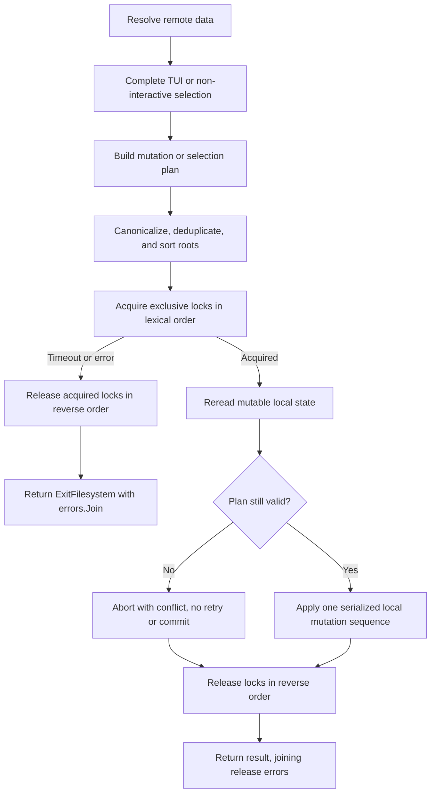

# ADR-0006: Use Advisory Root Locks for Library and Project Mutations

## Metadata

| Field | Value |
|---|---|
| Date | 2026-08-22 |
| Status | Accepted |
| Scope | Team |
| Authors | Peter O'Connor |
| Type | Decision |

## Problem Statement

Instill mutates library catalogs and project state through commands that may run concurrently in separate processes. Without cross-process coordination, two individually valid operations can interleave their reads and writes, lose updates, expose partial state, or violate invariants spanning multiple catalog files.

The library invariant is library-wide and cross-catalog: every mutation MUST preserve the consistency of all catalogs and referenced artifacts under the library root as one logical state. Locking only the file currently being written is insufficient when a mutation reads or updates related files.

Project mutations have the same coordination requirement. Per the approved decision, the project-wide scope MUST include the complete local mutation phase of APM install, prune, and compile. Those operations MUST NOT expose an intermediate project state to another cooperating Instill process.

## Decision Drivers

- Correct library-wide and project-wide invariants across processes
- Deterministic behavior under contention
- Minimal lock scope and acceptable command latency
- Deadlock prevention for imports and other multi-root operations
- Predictable error classification and cleanup
- Process-crash recovery without stale-lock deletion protocols
- Cross-platform compilation, including Windows
- A design that can be verified with deterministic cross-process tests

## Considered Options

### Option 1: Status Quo, No Cross-Process Locking

Each process continues to read and mutate files independently, relying on atomic replacement where available.

- Rejected because atomic replacement protects an individual file write, not a transaction spanning reads, catalogs, and artifacts.
- Rejected because concurrent commands can lose updates or violate library-wide and project-wide invariants.
- Rejected despite requiring no lock implementation or contention.
- Rejected despite providing maximum apparent concurrency.

### Option 2: Per-File Advisory Locks

Each mutable file receives its own advisory lock, acquired before access.

- Rejected because logical transactions span multiple files and require complex lock-set discovery.
- Rejected because cross-catalog invariants remain easy to violate and dynamic acquisition creates deadlock risks.
- Rejected despite allowing unrelated physical files to mutate concurrently.
- Rejected despite aligning lock ownership closely with individual writes.

### Option 3: Persistent Advisory Lock Per Root

Each library or project root contains a persistent `<root>/.instill.lock` file. Mutating operations acquire an exclusive advisory lock on the root before rereading, validating, and changing local state.

- Adopted because the lock boundary matches the Library-wide or Project-wide invariant.
- Adopted because stable lock files and canonical multi-root ordering provide an auditable deadlock-prevention protocol.
- Adopted despite serializing unrelated mutations under one root.
- Adopted despite advisory locks not constraining non-cooperating tools or guaranteeing cross-host behavior on unverified filesystems.

### Option 4: One Global Lock or Optimistic Compare-and-Swap

Two alternatives share this option because each avoids per-root transaction locking: serialize every mutation behind one machine-wide lock, or permit concurrency and commit only if a generation/hash still matches.

- Rejected because a global lock unnecessarily serializes unrelated roots and needs a reliable global location.
- Rejected because optimistic compare-and-swap requires versions across catalogs and artifacts plus staged publication.
- Rejected despite a global lock being simple on one machine.
- Rejected despite optimistic compare-and-swap permitting high concurrency under low contention.

## Advice

Chosen option: **Option 3, persistent advisory lock per root**, because its lock boundary directly represents the invariant being protected while allowing unrelated roots to proceed independently.

### Lock Representation and Acquisition

- Every lockable root MUST use the persistent lock file `<root>/.instill.lock`.
- The lock file MUST remain present after release. Callers MUST NOT delete it as part of normal cleanup.
- A mutating operation MUST acquire an exclusive root lock before reading mutable local state on which its mutation depends.
- Lock acquisition MUST time out after 10 seconds.
- Failure to create, open, acquire, or release a required lock MUST be represented as an `ExitFilesystem` error while preserving the underlying cause.
- The implementation SHOULD use `github.com/gofrs/flock` after a compatibility vet confirms its semantics and maintenance are acceptable for supported platforms.
- If `gofrs/flock` fails that vet, the implementation MUST use a platform-specific fallback behind the same internal interface. The fallback MUST preserve exclusive locking, the 10-second timeout, `ExitFilesystem` classification, process-crash release behavior where the platform supports it, and Windows compilation.
- CI MUST compile the locking implementation and its callers for Windows even when runtime lock tests execute only on supported CI hosts.

The dependency vet MUST cover, at minimum:

- exclusive advisory-lock behavior across independent processes;
- timed or retryable acquisition without an unbounded block;
- descriptor and unlock behavior on normal return and process termination;
- behavior when the lock file already exists;
- Unix and Windows build support; and
- the library's maintenance status and license compatibility.

#### Implemented Provider Vet

The implementation evaluated `github.com/gofrs/flock` v0.13.0. The project is actively maintained, released v0.13.0 on 2025-10-09, targets Go 1.24, supports Unix and Windows, implements retryable exclusive acquisition, retains an existing lock file, and relies on descriptor closure for process-exit release. Its BSD-3-Clause license is compatible with Instill's MIT license.

`gofrs/flock` was rejected for this contract because its file descriptor is private and its `Unlock` implementation closes that descriptor only after a successful operating-system unlock. A caller therefore cannot independently attempt both unlock and close or report both failures as ADR 0006 requires. Calling its public `Close` after a failed `Unlock` only retries the same combined operation and does not guarantee a separate close attempt.

Instill consequently uses the approved platform-specific fallback with `golang.org/x/sys` v0.44.0, whose BSD-3-Clause license is compatible. Unix builds open the persistent file and use nonblocking exclusive `flock`; Windows builds use nonblocking exclusive `LockFileEx`. Both providers expose separate `unlock` and `close` operations to the common internal interface, preserve the complete-set context deadline, leave the lock file in place, and depend on operating-system handle closure for process-crash release. CI cross-builds production callers and test packages for Windows `amd64` and `arm64`. These are local advisory semantics only; they do not strengthen the network-filesystem or cross-host guarantees stated below.

### Root Identity and Multiple Locks

Operations such as imports MAY mutate more than one root. Before acquiring any lock, an operation MUST:

1. Convert every root to an absolute, lexically cleaned path.
2. On Windows, normalize volume names, drive letters, UNC host/share names, and every path component to a case-folded comparison key while retaining one absolute path for filesystem access. On case-sensitive platforms, preserve component case.
3. Deduplicate roots by the platform canonical comparison key.
4. Sort comparison keys lexically in ascending order.
5. Acquire locks in that order.

The implementation MUST NOT resolve symlinks as part of this canonicalization unless a future decision changes root identity semantics. Therefore, callers SHOULD avoid addressing the same physical root through multiple symlink aliases.

If any acquisition fails, the operation MUST release all locks already acquired in reverse acquisition order. Normal final cleanup MUST release all still-held locks in reverse acquisition order. The one-way early-release protocol defined below is an explicit exception because it releases a root that is no longer needed and performs no later acquisition. If multiple acquisition, operation, or release errors occur, the implementation MUST preserve them with `errors.Join`. When any acquisition, unlock, or close operation fails, the joined causes MUST be wrapped by a top-level filesystem-classified exit error so `ExitCode` returns `ExitFilesystem` even when the primary operation failed first. The lock implementation MUST attempt both unlock and handle close and MUST report either failure.

### Context And Acquisition Deadline

- The lock API MUST accept `context.Context` and acquire the complete canonical lock set under one total 10-second acquisition deadline, not 10 seconds per root.
- An earlier caller deadline or cancellation MUST win. Acquisition MUST use the earlier of caller completion and the 10-second deadline and MUST NOT begin another root after context completion.
- Caller cancellation MUST return an actionable `ExitFilesystem` error identifying cancellation; expiration of the internal or caller deadline MUST identify lock-acquisition timeout. Both MUST include the canonical lock path currently awaited.
- Tests MAY inject a shorter timeout through an internal option; production command behavior MUST remain 10 seconds.

### Transaction Boundaries

Remote resolution, downloads, registry queries, and other network work MUST occur outside the root lock. After remote work completes, the command MUST acquire all required root locks, reread the affected local state, and revalidate every assumption used to construct the proposed mutation. Failed revalidation MUST return an actionable conflict with no automatic recomputation or retry.

- Remote Add has no pre-read snapshot. Under the Library lock it MUST load both typed catalogs, reject duplicate name, stable identity, or cross-catalog ownership, and otherwise append the resolved candidate.
- Remote Update MUST capture the original row's name, source, canonical repository, stable package identity, and ref before remote resolution. Under the Library lock it MUST reread the row. Missing rows or changes to name, source, repository, stable identity, or ref MUST return an actionable concurrent-catalog conflict without writing. If the row is unchanged, the resolved candidate MAY replace its ref while preserving curated metadata.
- A candidate that already equals the current locked row is a no-op. There are zero automatic conflict retries; the user MUST rerun after reviewing current catalog state.

Interactive TUI selection MUST complete before lock acquisition. A command MUST NOT hold a root lock while waiting for user input.

Initialization MUST separate selection from mutation:

- The command MUST finish TUI or non-interactive selection first.
- It MUST construct a selection plan that describes the intended library and project changes.
- It MUST acquire the complete, ordered root lock set once.
- It MUST reread and revalidate local state under those locks.
- It MUST preserve explicit user-selected targets by value. Automatically detected targets MUST be detected again under the Project lock.
- It MUST resolve selected Skill names against the current locked Library catalog; a missing name MUST fail without writing, while changed catalog metadata MUST be regenerated from the current entry.
- Without `--force`, a manifest that appeared before lock acquisition MUST return the existing-manifest error. With `--force`, the latest manifest document MUST be reread and unknown nodes preserved under ADR 0005.
- It MUST apply the selection plan in one manifest replacement and hold the Project lock through immediate APM install.

Imports MUST resolve and prepare remote or source data before locking when preparation does not depend on mutable destination state. An import that mutates source and destination roots MUST acquire both roots using the canonical ordering rules and MUST keep them held through all sequential local writes and source cleanup. Locks provide serial ordering, not rollback: an I/O failure MAY leave a partial import, but cooperating Instill mutations MUST NOT interleave with that partial sequence.

APM install, prune, and compile MUST hold the Project root lock across their complete local project mutation scope. APM is an explicit exception to the general network-outside-lock rule for the Project lock because installation MAY perform network access and the approved contract prioritizes rendered-state consistency. The Library lock MUST NOT remain held during APM operations.

### Internal API Structure

All lock ownership MUST enter through one internal `withRootLocks(ctx, roots, func(*heldLocks) error)` boundary. The unexported `heldLocks` capability MUST record canonical roots and MUST be required by every already-locked catalog/manifest helper; helpers MUST verify that the capability owns the expected root. Public mutation APIs acquire locks or delegate to a lock-owning operation and MUST NOT accept caller-constructed capabilities.

The capability MUST support one-way early release of a root that is no longer needed. Early release MUST unlock and close that root, mark it unavailable to later capability checks, and MUST NOT permit reacquisition inside the callback. An early-release unlock or close failure MUST prevent APM from starting and MUST follow the filesystem-classification rule above. Final cleanup releases all remaining roots in reverse acquisition order. Operations needing Library data plus Project mutation MUST acquire both roots once, hold both through locked reread/revalidation and manifest/content write, release Library, and retain Project through APM.

Already-locked helpers MUST NOT be exposed as general unlocked mutation entry points. Tests MUST verify that each public mutation path reaches an acquisition boundary and that nested operations use the locked helper path rather than recursively acquiring the same root lock.

### Exact Mutation Lock Scope

| Operation | Required roots and held interval |
|---|---|
| `WriteCatalog`, `AddCatalogEntry`, categorize, typed/full scan | Library root from latest dependent read/discovery through catalog, marker, or `.categories.json` write; full scan holds once across all types |
| Remote Skill/Plugin Add or Update | No lock during Git; Library root for locked reread, duplicate/conflict and cross-catalog validation, then catalog write |
| Claude/directory import | Library root through marker/content copies, scan/catalog writes, and source cleanup; directory import calls an already-locked scan helper |
| Old-Instill/Graft import | Canonically ordered Library and Project roots through latest reads, all catalog/marker/manifest writes, and legacy source cleanup |
| Skill/Plugin/MCP Pick and full selection | Acquire Library and Project together; hold both through catalog revalidation and manifest/content write, release Library, retain Project through APM install or prune |
| Instruction/Prompt Pick | Project root through copied-content add/remove; Library root is also required while revalidating selected source entries |
| Sync | Acquire Library and Project together; hold both through catalog reads, authoritative manifest read and optional replacement, release Library, retain Project through APM install and compile |
| Set targets | Project root for final authoritative read, mutation, and write; interactive target selection occurs before locking |
| Init | Interactive selection first; acquire Library and Project together for current-catalog resolution, authoritative existence/force reread, and one manifest write; release Library, retain Project through immediate APM install |
| Add hooks and supported project settings mutations | Project root from latest settings read through atomic write |

Read-only single-file commands MAY remain unlocked. A read requiring a coherent multi-catalog snapshot MUST acquire the Library root for the complete read.

### Process and Filesystem Semantics

The lock is advisory and attached to the process's open lock handle. On normal completion, Instill MUST explicitly unlock and close the handle. If the process crashes or is forcibly terminated, the operating system is expected to release the advisory lock when it closes the process's handles. The persistent `.instill.lock` file MAY remain and MUST NOT be interpreted as evidence that a lock is currently held.

External editors, scripts, older Instill versions, and other tools that do not participate in this protocol can still mutate files while a lock is held. Instill MUST NOT claim protection against non-cooperating processes. Documentation SHOULD advise automation that writes Instill-managed state to use Instill's locking protocol or invoke an Instill command that does.

Advisory-lock correctness on NFS, SMB, FUSE, container bind mounts, and other network or virtual filesystems depends on the server, mount options, client, and locking implementation. README and ADR 0006 MUST state that local filesystems are the supported correctness baseline, successful acquisition proves only participation in the local advisory protocol, and cross-host exclusion on an unverified filesystem is not guaranteed. When the lock library reports unsupported locking, Instill MUST return `ExitFilesystem` naming the path and filesystem limitation. Instill MUST NOT claim cross-host safety merely because acquisition succeeds.

## Decision Flow



## Consequences

### Positive

- Cooperating processes cannot concurrently mutate the same logical library or project root.
- The lock scope matches cross-catalog and project-wide invariants.
- Commands operating on unrelated roots can proceed concurrently.
- Canonical ordering makes multi-root acquisition deterministic and prevents protocol-compliant deadlocks.
- Remote work and user interaction do not consume lock time.
- Process crashes release operating-system lock ownership without stale-lock heuristics.

### Negative

- All mutations within one root are serialized, even when their physical file sets do not overlap.
- Every mutation path must distinguish lock-owning transaction boundaries from already-locked helpers.
- Remote resolution MAY become stale and require an actionable abort and user-initiated retry after locked revalidation.
- Advisory locks cannot prevent modification by external, non-cooperating tools.
- Cross-host guarantees on network filesystems cannot be assumed.
- A new locking dependency or equivalent platform-specific implementation must be maintained.

### Neutral

- `.instill.lock` becomes a persistent implementation artifact in each initialized root and SHOULD be excluded from user-authored content processing.
- Read-only operations MAY remain unlocked when they tolerate a before-or-after snapshot. Reads requiring a transactionally consistent multi-file snapshot MUST acquire the same root lock or use a separately approved snapshot mechanism.

## Impact

**Instill Maintainers** MUST implement the lock capability and migrate every supported mutation boundary during the current reliability track before merge. Existing users need no migration; persistent `.instill.lock` files appear lazily on the next mutation.

The rollout MUST follow ADR 0005 so project locks protect the node-semantic document adapter. Remote Git bounds from ADR 0007 follow this change and MUST preserve the resolve-outside/commit-under-lock boundary.

## Confirmation

Tests MUST use independent helper processes, not goroutines alone, to establish cross-process behavior. Synchronization MUST use explicit pipes, sockets, sentinel files, or test-only control channels; tests MUST NOT depend on arbitrary sleeps to create contention. Test timeouts MAY bound hangs, but MUST NOT define event ordering.

Automated CI/CD enforcement MUST run the deterministic process tests, race suite, standard tests, lint, vet, BATS, release validation, and supported-platform builds described below.

### Exclusive Root Mutation

```gherkin
Feature: Exclusive root mutation
  Scenario: A second process waits for the same root
    Given process A has acquired the root lock and signaled readiness
    And process B attempts to acquire the same root lock
    When process A is instructed to release the lock
    Then process B acquires the lock only after process A reports release
    And both processes exit successfully

  Scenario: Unrelated roots do not block each other
    Given process A has acquired a lock for root A and signaled readiness
    When process B attempts to acquire a lock for root B
    Then process B acquires root B before process A is instructed to release root A
```

### Timeout and Error Classification

```gherkin
Feature: Bounded lock acquisition
  Scenario: Contention exceeds the acquisition deadline
    Given process A holds a root lock beyond the configured 10 second deadline
    When process B attempts to acquire the same root lock
    Then process B fails after 10 seconds within an explicit scheduler-tolerance bound
    And the result is classified as ExitFilesystem
    And the underlying timeout cause is preserved
```

The timeout test SHOULD inject a clock or configurable test deadline when the locking abstraction permits it, while a separate integration test MUST verify the production 10-second configuration without relying on an exact nanosecond boundary.

### Deterministic Multi-Root Ordering

```gherkin
Feature: Deadlock-free multi-root locking
  Scenario: Two processes request the same roots in opposite input orders
    Given process A requests roots beta and alpha
    And process B requests roots alpha and beta
    When both processes are released from a test barrier simultaneously
    Then both normalize the lock set to alpha followed by beta
    And each process eventually completes without deadlock

  Scenario: Duplicate lexical roots are acquired once
    Given a lock request contains equivalent absolute lexical paths after cleaning
    When the lock set is prepared
    Then only one lock acquisition occurs for that canonical path

  Scenario: Partial acquisition failure releases in reverse order
    Given acquisitions for alpha and beta succeed
    And acquisition for gamma deterministically fails
    When cleanup runs
    Then beta is released before alpha
    And all acquisition and release failures are preserved with errors.Join
    And the result is classified as ExitFilesystem
```

### Revalidation and Transaction Scope

```gherkin
Feature: Revalidation under lock
  Scenario: Local state changes during remote resolution
    Given process A reads local state and pauses in controlled remote resolution
    And process B acquires the root lock, commits a mutation, and releases it
    When process A completes remote resolution and acquires the lock
    Then process A rereads the local state under the lock
    And process A rejects its stale plan with an actionable conflict
    And process A does not overwrite process B's mutation

Feature: Selection precedes locking
  Scenario: The TUI waits for user selection
    Given a test TUI is waiting at a controlled selection barrier
    When another process mutates the same root
    Then the other process acquires and releases the root lock successfully
    And the TUI process requests the lock only after selection completes

Feature: Initialization is one serialized mutation
  Scenario: A selected initialization plan resolves current catalog state
    Given selection has produced a complete initialization plan
    When initialization acquires its ordered root lock set
    Then it rereads and revalidates all affected local state
    And it writes no intermediate manifest
    And it holds the Project lock through immediate APM install

Feature: Approved project-wide APM scope
  Scenario Outline: Another project mutation contends with an APM command
    Given process A is paused after the first local mutation of <command>
    When process B attempts to mutate the same project root
    Then process B cannot acquire the project lock
    And process B acquires it only after process A completes all local mutations

    Examples:
      | command |
      | install |
      | prune   |
      | compile |

  Scenario: Library lock is released before APM while Project remains locked
    Given an operation acquired Library and Project roots together
    And it completed catalog revalidation and manifest publication
    When APM signals it started and waits at a controlled barrier
    Then another Library-only mutation acquires and releases the Library lock before the barrier is released
    And another Project mutation remains blocked at that barrier
    When the test releases the APM barrier and APM completes
    Then the Project mutation acquires its lock
    And the operation does not reacquire the released Library root
```

### Import, Crash, and Compatibility Behavior

```gherkin
Feature: Multi-root import
  Scenario: Import updates a library and project
    Given remote import resolution has completed without a lock
    When the import acquires the canonical ordered library and project lock set
    Then it rereads and revalidates both roots
    And it performs all local import mutations and cleanup before releasing either lock
    And no cooperating Instill mutation interleaves even if an I/O failure leaves partial import state

Feature: Process crash recovery
  Scenario: A lock holder exits without explicit unlock
    Given process A has acquired a root lock and signaled readiness
    When the test harness forcibly terminates process A and confirms its exit
    Then process B acquires the same persistent lock file
    And the lock file still exists after process B releases it

Feature: Windows compilation
  Scenario: The locking packages are cross-compiled
    Given the repository is built with GOOS set to windows for every supported architecture
    When CI compiles the locking implementation and command callers
    Then compilation succeeds without Unix-only symbols in shared files
```

### Serializable Final State

```gherkin
Feature: Catalog mutations preserve successful updates
  Scenario: Two distinct catalog additions race
    Given a Library catalog contains base
    And process A adds one while process B adds two
    When both additions report success
    Then the final valid CSV contains base, one, and two exactly once

  Scenario: Skill and Plugin registration race for one Git identity
    Given two resolved candidates have the same stable Git identity
    When one process registers a Skill and another registers a Plugin
    Then at most one registration succeeds
    And the loser identifies the current typed owner
    And the final catalogs pass typed ownership validation

Feature: Project mutations preserve non-conflicting intent
  Scenario: Two additive picks race
    Given a Project contains dependency base
    When process A adds one and process B adds two
    Then the final manifest contains base, one, and two
    And ADR 0005 unknown nodes remain preserved

  Scenario: Pick races target update
    Given a Project has an existing manifest
    When process A adds a dependency and process B sets targets
    Then the final manifest contains both the dependency and target changes

  Scenario: Sync races Pick
    Given sync requires manifest reconciliation
    When another process picks a dependency
    Then both operations execute in a complete serial order
    And the final rendered state corresponds to the final manifest
```

### Platform And Filesystem Boundaries

```gherkin
Feature: Windows root aliases
  Scenario: Equivalent roots differ by drive or component case
    Given two Windows paths identify the same root with different casing
    When a lock set is canonicalized
    Then both paths produce one case-folded comparison key and one acquisition

Feature: Unsupported advisory locking
  Scenario: The lock provider reports an unsupported filesystem operation
    When Instill acquires the root lock
    Then it returns ExitFilesystem naming the lock path and unsupported locking
    And it does not claim cross-host safety
```

### CI Gates

Pull requests changing mutation paths, transaction boundaries, root identity, or lock code MUST pass all of the following gates:

- unit tests for absolute lexical normalization, cleaning, sorting, deduplication, reverse release, and `errors.Join` behavior;
- deterministic independent-process integration tests for exclusion, unrelated-root concurrency, timeout classification, opposite-order multi-lock requests, locked reread/revalidation, TUI-before-lock behavior, initialization serialization, import scope, successful distinct catalog adds, cross-catalog ownership races, additive picks, Pick versus targets, Sync versus Pick, APM install/prune/compile scope, and crash release;
- race-enabled tests on supported Go CI platforms using `go test -race ./...`;
- the repository's standard tests using `go test ./...`;
- Windows cross-compilation for supported architectures; and
- static analysis and formatting gates already required by the repository.

CI MUST fail if a deterministic test cannot prove process ordering through an explicit synchronization event. Flaky retry loops and sleep-based ordering MUST NOT be accepted as substitutes.

## Implementation Notes

- The lock abstraction SHOULD expose acquisition of a complete root set rather than encouraging incremental acquisition.
- The transaction callback or equivalent MUST receive only after all requested locks are held.
- The implementation MUST preserve the primary operation error when unlock or close also fails by returning `errors.Join(primaryErr, releaseErr...)`.
- Cancellation MAY end acquisition before 10 seconds. It MUST NOT extend acquisition beyond the 10-second maximum.
- Logging SHOULD identify the canonical root and elapsed wait without logging sensitive catalog contents.
- Metrics MAY record acquisition latency, timeout count, and held duration, but instrumentation MUST NOT alter lock ordering.

## Revisit Criteria

This decision SHOULD be revisited if measured contention makes root-level serialization a material bottleneck, if Instill requires verified cross-host mutation over network filesystems, or if a transactional storage layer replaces file-based catalogs. Any replacement MUST preserve the library-wide cross-catalog invariant and the approved project-wide APM transaction scope.

*Authored By Peter O'Connor with Assistance from OpenCode (openai/gpt-5.6-sol) · 2026-08-22 · ADR-0006 advisory locking decision for Instill library and project mutations*
