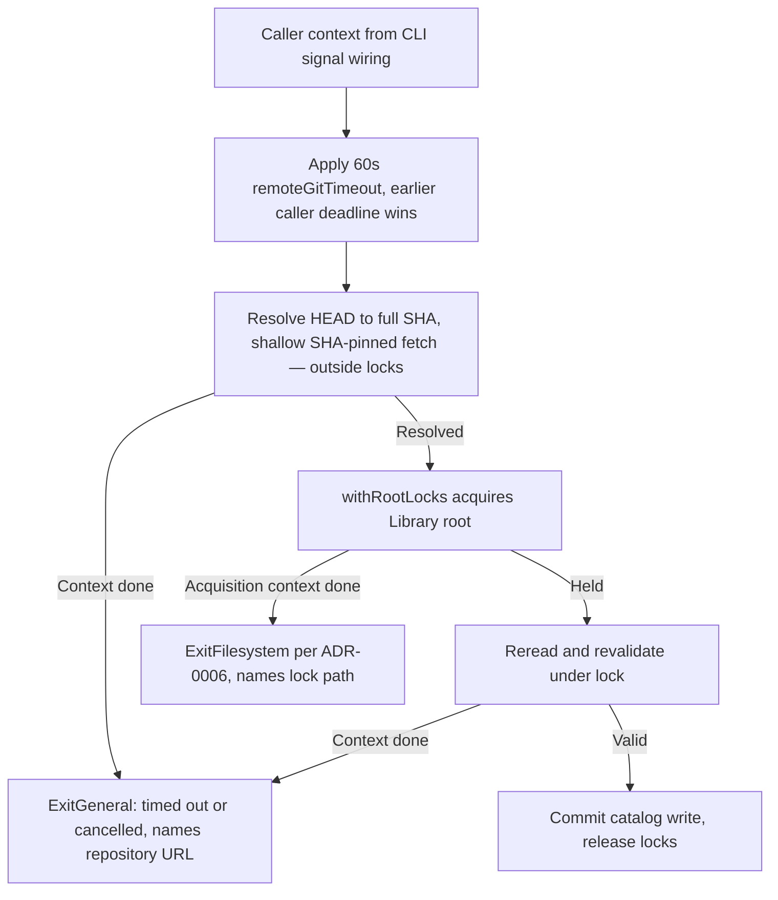

# ADR-0007: Bound Remote Git Operations with Context Deadlines

## Metadata

| Field | Value |
|---|---|
| Date | 2026-08-23 |
| Status | Accepted |
| Scope | Team |
| Authors | Peter O'Connor |
| Type | Decision |

## Problem Statement

Remote Skill and Plugin resolution shells out to `git ls-remote`, `git init`, `git remote add`, and `git fetch` through a `CommandRunner` that has no deadline. An unavailable, slow, or adversarial remote can block any of those commands indefinitely, hanging the CLI. Fetch cost is bounded today only by convention (`--depth 1` pinned to a full SHA), not by a stated contract.

ADR-0006 requires remote resolution to happen outside root locks and anticipates this decision: "Remote Git bounds from ADR 0007 follow this change and MUST preserve the resolve-outside/commit-under-lock boundary."

## Decision Drivers

- Guaranteed termination against unavailable or adversarial remotes
- Caller-driven cancellation (Ctrl-C, test harnesses) that actually stops work
- No weakening of immutable full-SHA resolution
- Deterministic tests without live-network dependence
- Minimal churn to the existing `CommandRunner` injection seam

## Considered Options

### Option 1: Status Quo, Unbounded Runner

- Rejected because a hung `git` subprocess hangs the command forever.
- Rejected because cancellation has no effect once a subprocess starts.
- Rejected despite requiring no code change.

### Option 2: Per-Command Wall-Clock Timeouts Without Context

Give each git invocation its own fixed timer with no `context.Context` plumbing.

- Rejected because caller cancellation still cannot interrupt resolution.
- Rejected because N per-command timers give an unbounded total (N × timeout) worst case.
- Rejected despite being a small localized change.

### Option 3: Context Propagation with One Total Resolution Deadline

Public remote APIs accept `context.Context`; the domain applies one total production deadline to the complete operation; the earlier of the caller deadline and the production deadline wins.

- Adopted because one total bound composes with ADR-0006's 10-second lock deadline and gives a provable worst case.
- Adopted because `context` is the idiomatic Go cancellation carrier and flows through Cobra's `cmd.Context()`.
- Adopted despite requiring a signature migration of the four public remote functions and their call sites.

### Option 4: Replace git CLI with go-git

- Rejected because it swaps a vetted execution model for a large dependency with its own transport semantics.
- Rejected despite offering native context support.

## Advice

Chosen option: **Option 3, context propagation with one total resolution deadline**.

### API Contract

- `AddRemoteSkill`, `UpdateRemoteSkill`, `AddRemotePlugin`, and `UpdateRemotePlugin` MUST accept `context.Context` as their first parameter and MUST propagate it through `openGitSnapshot`, every subsequent git invocation, local snapshot reads, and the locked commit phase. The locked commit phase MUST NOT receive a fresh uncancelled context.
- The domain MUST apply a total deadline of **60 seconds** to the complete operation, held in the internal variable `remoteGitTimeout`. Tests MAY override the variable; production behavior MUST remain 60 seconds. The deadline MUST apply even when the caller context has no deadline. An earlier caller deadline or cancellation MUST win, and the bound MUST NOT be extended beyond 60 seconds.
- The 60-second bound applies only to remote Git resolution. APM install, prune, and compile MUST NOT inherit it.
- The `CommandRunner` injection seam is unchanged. Execution MUST be bounded **per git invocation** around every runner, including the default: when the context completes, the invocation MUST return the context error even if the runner has not returned. The default (nil-runner) path MUST execute git via `exec.CommandContext` so an expired context kills the subprocess, and MUST set `Cmd.WaitDelay` so a child process holding inherited descriptors cannot extend the bound.
- Once the bounded error has been returned to the caller, the operation MUST NOT perform any further catalog mutation, including from abandoned goroutines.
- A bounded failure MUST NOT write any catalog state.

### Error Classification

- Context failures arising from remote Git execution or detected by domain code (including the locked commit phase) MUST be classified `ExitGeneral` and MUST name the canonical repository URL.
- Once the bounded context enters `withRootLocks`, ADR-0006 governs lock acquisition: acquisition failures remain `ExitFilesystem` naming the canonical lock path, and likewise preserve the context cause.
- Deadline expiry MUST preserve `context.DeadlineExceeded` and its message MUST contain `timed out`; caller cancellation MUST preserve `context.Canceled` and its message MUST contain `cancelled`. This matches the vocabulary ADR-0006's lock errors already use.

### CLI Wiring

- `Execute` MUST derive a context with `signal.NotifyContext(SIGINT, SIGTERM)` and run the root command with `ExecuteContext`; remote commands MUST pass `cmd.Context()` into the domain.

### Fetch Cost

- Resolution MUST keep resolving the remote default branch to a full 40-hex SHA before any fetch.
- The snapshot fetch MUST remain `fetch --depth 1 origin <sha>`: no clone, no branch-pattern fetch, no history.

### ADR-0006 Boundary

- Remote resolution stays outside root locks; the locked reread/revalidate/commit phase is unchanged and runs inside the same bounded context.

## Decision Flow



## Confirmation

Tests MUST NOT depend on live networks. Blocking behavior is simulated with injected runners that block on a channel; tests MUST bound their own waits and MUST fail, not hang, when the operation is unbounded.

```gherkin
Feature: Bounded remote resolution
  Scenario Outline: A blocked remote command terminates at the caller deadline
    Given a runner whose ls-remote blocks indefinitely
    And a caller context with a short deadline
    When <operation> runs
    Then it returns before the test's wait bound
    And the error preserves context.DeadlineExceeded and contains "timed out"
    And the error is classified ExitGeneral and names the repository URL
    And the typed catalog for the operation is unchanged

    Examples:
      | operation          |
      | AddRemoteSkill     |
      | UpdateRemoteSkill  |
      | AddRemotePlugin    |
      | UpdateRemotePlugin |

  Scenario: Cancellation during the fetch phase interrupts resolution
    Given a runner that signals when fetch is blocked
    When the caller cancels the context after the signal
    Then the operation returns promptly with context.Canceled preserved
    And the message contains "cancel" and names the repository URL
    And no catalog entry is written

  Scenario: Caller cancellation interrupts a blocked ls-remote
    Given a runner that signals when ls-remote is blocked
    When the caller cancels the context after the signal
    Then the operation returns promptly with context.Canceled preserved

  Scenario: The production deadline applies without a caller deadline
    Given remoteGitTimeout is overridden to a short test value
    And the caller context has no deadline
    When AddRemoteSkill runs against a blocked ls-remote
    Then the operation terminates at the production deadline with context.DeadlineExceeded

  Scenario: Production deadline is sixty seconds
    Then remoteGitTimeout equals 60 seconds

  Scenario: Cancellation during locked revalidation aborts without writing
    Given an update paused at the locked revalidation event
    When the caller cancels the context at that event
    Then the operation returns context.Canceled classified ExitGeneral naming the repository URL
    And the catalog row keeps its previous ref

  Scenario: Fetch stays shallow and SHA-pinned
    When AddRemoteSkill resolves a healthy remote
    Then exactly one fetch runs with --depth 1 origin <full sha>
    And no clone command runs
```

## Consequences

### Positive

- Every remote operation has a provable worst-case duration.
- Ctrl-C stops in-flight git subprocesses on the default path through the mandated CLI signal wiring.
- The contract pins shallow SHA-pinned fetch as a tested invariant, not a convention.

### Negative

- Four public signatures change; all call sites and tests migrate mechanically.
- A single total deadline can expire mid-fetch of an unusually large snapshot; the user must retry on a better connection.

### Neutral

- Injected test runners that block are abandoned after the bound; only the default path kills processes. Abandoned execution cannot mutate catalogs after the bounded error returns.

## Impact

**Instill Maintainers** migrate the four public remote functions, their CLI call sites, and tests in one change. Users see no behavioral change on healthy remotes; unavailable remotes now fail within 60 seconds instead of hanging.

## Implementation Notes

- The killed subprocess MUST be reaped (its `Wait` returned, bounded by `WaitDelay`) before the snapshot temporary directory is removed, so cleanup does not race a writer.
- The bounded error SHOULD state which git phase was in flight when the bound hit, without echoing full command lines.
- On the default path, the observed worst case is the 60-second `remoteGitTimeout` bound plus up to the `WaitDelay` (~5 seconds) the killed subprocess is given to exit before its reap completes.

## Revisit Criteria

Revisit if legitimate snapshots routinely exceed 60 seconds, if per-phase budgets become necessary, or if git execution moves off the CLI.

*Authored By Peter O'Connor with Assistance from Claude Code (claude-fable-5) · 2026-08-23 · ADR-0007 bounded remote Git operations for Instill*
