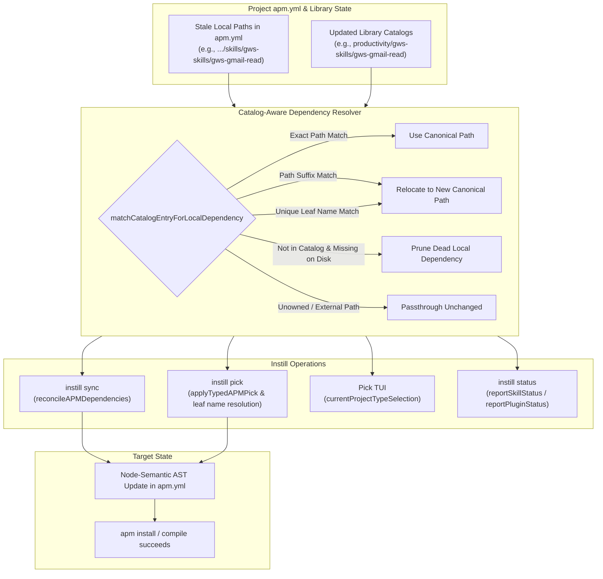

# Local Skill and Plugin Reconciliation Implementation Plan

> **For agentic workers:** REQUIRED SUB-SKILL: Use superpowers:subagent-driven-development (recommended) or superpowers:executing-plans to implement this plan task-by-task. Steps use checkbox (`- [ ]`) syntax for tracking.

**Goal:** Reconcile relocated, moved, or categorized local skill and plugin dependencies in project APM manifests (`apm.yml`) against the current library catalog so that `instill sync`, `instill pick`, `instill library sync`, and `instill status` seamlessly handle library reorganization without `apm install` failing with missing local package errors.

**Architecture:** Implement a catalog-aware local dependency matcher that detects when a local dependency under `libraryPath/skills` or `libraryPath/plugins` has moved (matching by canonical path, path suffix, or unique leaf name). Centralize reconciliation in `reconcileAPMDependencies` to automatically update `apm.yml` dependencies before running APM install/compile. Update the pick TUI selection state, CLI leaf-name resolver, and status reporter to use the same catalog matching logic.

**Tech Stack:** Go, `gopkg.in/yaml.v3`, Bubbletea TUI, APM CLI manifest contract

---

## Global Constraints

- Instill MUST treat the Library catalog as authoritative for the canonical local paths of Library-owned skills and plugins.
- Instill MUST automatically reconcile relocated or categorized skills and plugins in `dependencies.apm` during `instill sync` and `instill pick`.
- Instill MUST drop/prune library-owned local paths from `dependencies.apm` during `sync` if they no longer exist in the catalog and no longer exist on disk.
- Instill MUST preserve unowned (external) local dependencies and Git dependencies unchanged.
- Instill MUST deduplicate dependencies when old and new paths reconcile to the same canonical catalog dependency.
- Instill MUST preserve YAML comments, styles, and sequence order using node-semantic manifest updates (`mutateAPM`) when updating local dependency paths in-place.
- Instill MUST accurately reflect relocated skills as selected in the interactive TUI (`instill pick`).
- Instill MUST allow resolving unambiguous leaf skill names in CLI commands (e.g. `instill pick todo-cli`).
- Every change MUST follow BDD red-green-refactor cycles and adhere to RFC 2119 terminology.

---

## Architectural Flow

---

## Implementation Tasks

### Task 1: Catalog Matching Engine (`matchCatalogEntryForLocalDependency`)

**Files:**
- Modify: `internal/instill/catalog.go`
- Modify: `internal/instill/catalog_test.go`

**Interfaces:**
- `matchCatalogEntryForLocalDependency(libraryPath string, typ LibraryType, localPath string, catalog []CatalogEntry) (CatalogEntry, bool)`

- [ ] **Step 1: Write failing unit tests for catalog matching**
  Add tests in `catalog_test.go`:
  - Matching by exact canonical path (`skillDependencyPath(libraryPath, entry)`).
  - Matching by path suffix (e.g. `gws-skills/gws-gmail-read` matching catalog entry `productivity/gws-skills/gws-gmail-read`).
  - Matching by category reorganization (e.g. `pm-product-strategy/skills/product-vision` matching `product-management/skills/product-vision`).
  - Matching by unique leaf name (e.g. `product-vision` matching `product-management/skills/product-vision`).
  - Ambiguous matching returning `false` (e.g. multiple skills sharing the same leaf name under different categories without unique suffix).
  - Unowned local path outside `libraryPath` returning `false`.

- [ ] **Step 2: Run tests and verify RED**
  `go test ./internal/instill -run 'TestMatchCatalogEntryForLocalDependency' -count=1`

- [ ] **Step 3: Implement `matchCatalogEntryForLocalDependency` in `catalog.go`**
  1. Exact canonical path match.
  2. If under `libraryPath/<type>`, extract relative path.
  3. Suffix match against `entry.Name` and `entry.Path`.
  4. Leaf name match against `entry.Name` if unique across catalog.

- [ ] **Step 4: Run tests and verify GREEN**

---

### Task 2: APM Local Dependency Reconciliation (`reconcileAPMDependencies`)

**Files:**
- Modify: `internal/instill/sync.go`
- Modify: `internal/instill/sync_test.go`

**Interfaces:**
- `reconcileAPMDependencies(current []APMDependency, libraryPath string, skillCatalog []CatalogEntry, pluginCatalog []CatalogEntry) ([]APMDependency, bool)`

- [ ] **Step 1: Write failing unit tests for `reconcileAPMDependencies`**
  Add tests in `sync_test.go`:
  - Reconciling relocated skill path from `skills/gws-skills/gws-gmail-read` to `skills/productivity/gws-skills/gws-gmail-read`.
  - Reconciling relocated plugin path.
  - Pruning stale library skill that neither matches catalog nor exists on disk.
  - Retaining custom local skill that exists on disk even if not in catalog.
  - Deduplicating redundant entries (when old and new paths both exist in manifest).
  - Preserving external unowned paths and Git dependencies.

- [ ] **Step 2: Run tests and verify RED**
  `go test ./internal/instill -run 'TestReconcileAPMDependencies' -count=1`

- [ ] **Step 3: Implement `reconcileAPMDependencies` in `sync.go`**
  Integrate `matchCatalogEntryForLocalDependency` for skills and plugins, pruning missing dead paths and deduplicating canonical results.

- [ ] **Step 4: Run tests and verify GREEN**

---

### Task 3: Integrate Reconciliation into `instill sync` & Status Reporting

**Files:**
- Modify: `internal/instill/sync.go`
- Modify: `internal/instill/sync_test.go`

- [ ] **Step 1: Write failing BDD test for `SyncProject` with relocated library skills**
  In `sync_test.go`, create a project with an `apm.yml` referencing old paths (e.g. `skills/gws-skills/gws-gmail-read`), set up the library with `skills/productivity/gws-skills/gws-gmail-read`, and assert:
  - `SyncProject` rewrites `apm.yml` to the new canonical path.
  - `apm install --root <project>` is called with the corrected manifest.
  - Preserved YAML comments and formatting remain intact.

- [ ] **Step 2: Run tests and verify RED**
  `go test ./internal/instill -run 'TestSyncProjectReconcilesRelocatedLocalSkills' -count=1`

- [ ] **Step 3: Update `syncProjectLocked`, `reportSkillStatus`, and `reportPluginStatus` in `sync.go`**
  - Call `reconcileAPMDependencies` before `document.mutateAPM`.
  - Update `reportSkillStatus` and `reportPluginStatus` to recognize relocated skills instead of emitting false "removed from library" / "available in library" pairs.

- [ ] **Step 4: Run tests and verify GREEN**

---

### Task 4: Node-Semantic In-Place AST Local Node Updates (`mutateAPM`)

**Files:**
- Modify: `internal/instill/apm_manifest_document.go`
- Modify: `internal/instill/apm_manifest_document_test.go`

- [ ] **Step 1: Write failing test in `apm_manifest_document_test.go`**
  Assert that when a local dependency path is relocated, `mutateAPM` updates the scalar node value in-place, preserving node comments, sequence position, and anchors.

- [ ] **Step 2: Run tests and verify RED**
  `go test ./internal/instill -run 'TestMutateAPMPreservesCommentsOnRelocatedLocalDependency' -count=1`

- [ ] **Step 3: Update `mutateAPM` in `apm_manifest_document.go`**
  When processing existing local nodes, if the node's local path is relocated to a desired canonical path, mutate the scalar value in-place and mark it matched.

- [ ] **Step 4: Run tests and verify GREEN**

---

### Task 5: Integrate with Pick & Selection (`instill pick`, TUI, `ownedDependencyNames`)

**Files:**
- Modify: `internal/instill/pick_skills.go`
- Modify: `internal/instill/skill_picker.go`
- Modify: `internal/instill/pick_skills_test.go`
- Modify: `internal/instill/skill_picker_test.go`

- [ ] **Step 1: Write failing tests for pick and TUI with relocated skills**
  - Test `currentProjectTypeSelection` returns relocated skills as selected.
  - Test `applySkillPick` updates relocated dependencies to canonical catalog paths when adding new skills.
  - Test `resolveSkillDependencies` resolves unambiguous leaf names (e.g. `todo-cli` -> `productivity/todo-cli`).
  - Test `ownedDependencyNames` returns current catalog entry names for relocated skills and plugins.

- [ ] **Step 2: Run tests and verify RED**
  `go test ./internal/instill -run 'TestPick|TestCurrentProjectTypeSelection|TestResolveSkillDependencies' -count=1`

- [ ] **Step 3: Update `pick_skills.go` and `skill_picker.go`**
  - Update `applyTypedAPMPick` to use `matchCatalogEntryForLocalDependency`.
  - Update `currentProjectTypeSelection` to use `matchCatalogEntryForLocalDependency`.
  - Update `resolveSkillDependencies` to support unique leaf/suffix name matching.
  - Update `ownedDependencyNames` to use `matchCatalogEntryForLocalDependency` for both skills and plugins.

- [ ] **Step 4: Run tests and verify GREEN**

---

### Task 6: End-to-End Verification & Quality Gates

**Files:**
- All packages under `internal/...`

- [ ] **Step 1: Run full test suite**
  `go test -count=1 ./...`
- [ ] **Step 2: Run linter**
  `golangci-lint run`
- [ ] **Step 3: Validate with reproduction scenario**
  Verify the exact case from the bug report: library scan with categorized skills + project `apm.yml` containing old paths + `instill pick` or `instill sync`.
