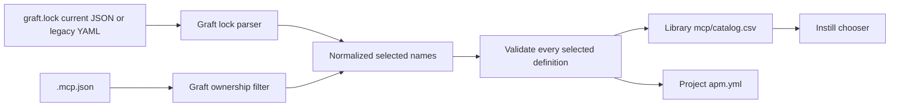

# Graft MCP Migration Compatibility Design

## Context

Instill's unified picker reads MCP Server choices from the configured Library's `mcp/catalog.csv`. Peter's configured Library is `~/peter_code/ai_support`, whose MCP catalog currently contains no entries.

The existing `instill import graft` command reads a legacy `graft.lock` shape containing a top-level `servers` list. The live Graft repository instead uses a JSON-compatible lock with a top-level `mcps` array. Each current lock entry names an MCP Server and records its library, version, definition hash, and target. The adjacent `.mcp.json` contains the executable MCP Server definitions and marks Graft-owned definitions with `_graft_managed: true`.

## Decision

Instill MUST accept both supported Graft lock representations:

- the current `mcps` array, whose objects contain MCP Server names;
- the legacy `servers` list of MCP Server names.

The migration selection MUST be the normalized union of:

- names recorded in either supported lock representation; and
- names whose `.mcp.json` definitions contain `_graft_managed: true`.

This rule ensures that a Graft-managed MCP Server such as `markitdown` is not silently lost merely because it is absent from the current lock. Explicit unmanaged `.mcp.json` entries MUST NOT be imported by `instill import graft` unless the lock selects them.

For Peter's live Graft repository, the expected migrated set is:

- `Stack Internal`;
- `markitdown`;
- `serena`.

## Data Flow

## Validation and Safety

Before mutating any file, the importer MUST verify that every selected name has a corresponding `.mcp.json` definition. A missing definition MUST fail the migration and name every missing MCP Server.

The importer MUST preserve each selected definition's transport, command, arguments, URL, and environment references. It MUST retain existing Library descriptions when merging by name.

The importer MUST NOT remove `graft.lock` or imported definitions from `.mcp.json` until the Library catalog and APM manifest writes succeed. The live migration MUST retain a recoverable source until the resulting catalog and chooser output have been verified.

## Compatibility Boundary

The current and legacy lock representations MUST remain supported. An input that contains neither representation and has no Graft-managed `.mcp.json` definitions MUST fail with actionable guidance rather than report a successful empty migration.

This change MUST NOT broaden `instill import claude` or generic directory-import behavior.

## Testing

BDD regression coverage MUST prove:

- a current JSON `graft.lock` imports its `mcps` names;
- the legacy `servers` representation remains supported;
- a Graft-managed but unlocked definition is imported;
- an unmanaged and unlocked definition is excluded;
- missing selected definitions fail before mutation;
- a source with no selected Graft MCP Servers fails rather than deleting migration inputs;
- command, arguments, URL, transport, and environment references survive migration;
- the migrated live Library lists all three expected MCP Servers through `instill library show --type mcp`.

## Completion Criteria

The work is complete only when the regression tests and full Go quality gates pass, the configured Library contains the three expected MCP Server entries, and Instill's catalog-backed chooser can load those same entries.

*Authored By Peter O'Connor with Assistance from Codex (GPT-5) · 2026-07-12 · Instill Graft MCP migration compatibility design*
