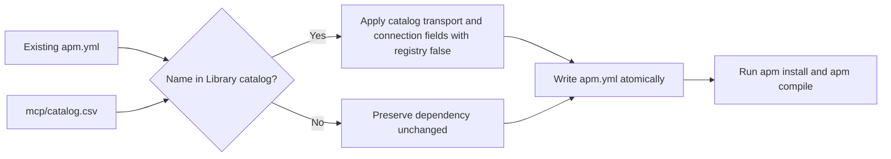

# MCP Manifest Repair Design

## Context

Instill's MCP Server catalog records each server's transport and executable or URL configuration. Instill currently writes only the name, command, arguments, environment references, and URL to `apm.yml`. APM therefore applies its default `registry: true` behavior and attempts to resolve catalog-defined MCP Servers from its public registry.

## Decision

Instill MUST treat an MCP Server selected from the configured Library as a self-defined APM dependency. New dependencies MUST include the catalog transport and `registry: false`.

`instill sync` MUST reconcile existing MCP dependencies against the configured Library before invoking APM. When an existing dependency's name matches a Library catalog entry, Instill MUST replace its MCP connection fields with the catalog definition and set `registry: false`. When no catalog entry matches, Instill MUST preserve the dependency unchanged so legitimate registry dependencies remain valid.

## Data Model

`MCPDependency` MUST represent `transport` and `registry` in addition to its existing fields. The representation MUST distinguish an omitted registry value from an explicit `false`, because unmatched registry dependencies MUST round-trip without being reclassified.

Catalog entries are authoritative for matched self-defined dependencies. Reconciliation MUST copy `name`, `transport`, `command`, `args`, `env`, and `url` from the catalog and MUST explicitly set `registry: false`.

## Sync Behavior

Sync MUST load the Library MCP catalog before calling APM. It MUST reconcile the manifest in memory, write it atomically only when reconciliation changes it, and then continue through the existing install and compile sequence.

A malformed catalog MUST fail with the existing actionable catalog error before APM runs. An unmatched dependency MUST NOT be rejected or modified merely because it lacks local connection fields.

## Considered Alternatives

1. **Catalog-authoritative repair:** repairs known local definitions and preserves unknown registry dependencies. Selected.
2. **Mark every object-form dependency local:** smaller, but incorrectly reclassifies legitimate registry dependencies.
3. **Repair only after APM fails:** couples Instill to APM error text and adds a failed network lookup to the normal path.

## BDD Acceptance Criteria

- A new stdio MCP Server pick MUST emit `transport: stdio` and `registry: false`.
- A new HTTP MCP Server pick MUST emit `transport: http` and `registry: false`.
- Sync MUST repair an incomplete dependency whose name matches the Library catalog.
- Sync MUST preserve an unmatched registry dependency.
- Reconciliation MUST preserve the catalog's command, arguments, environment references, and URL.
- The resulting self-defined dependency shape MUST satisfy APM's documented manifest contract.

## Scope

This change MUST NOT rename MCP Servers, infer ownership from spelling, modify the Library catalog, or change skill, instruction, prompt, install, or compile semantics.
